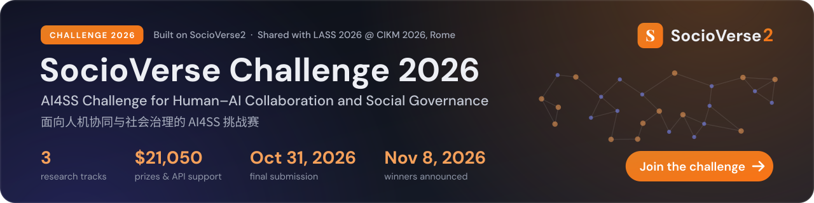

<!-- ───────────────────────── Challenge banner ─────────────────────────
     Files: assets/challenge-banner.svg (dark card) + assets/challenge-banner-light.svg.
     Both are self-contained (text outlined to paths, no fonts/scripts/external refs),
     so GitHub renders them through . <picture> follows the viewer's GitHub theme.
     Remove this block (and the Challenge badge and News line) after the awards on 2026-11-08. -->
<p align="center">
  <a href="https://socioverse.fudan-disc.com/challenge/">
    <picture>
      <source media="(prefers-color-scheme: dark)" srcset="assets/challenge-banner.svg">
      <source media="(prefers-color-scheme: light)" srcset="assets/challenge-banner-light.svg">
      
    </picture>
  </a>
</p>

<h1 align="center">SocioVerse2</h1>

<p align="center">
  <b>Social evolution, visible and testable.</b><br>
  Researchers and AI agents build longitudinal social simulations together:
  intervene, branch a counterfactual, and reproduce every version.
</p>

<p align="center">
  <a href="https://arxiv.org/abs/2609.24911"></a>
  <a href="https://socioverse.fudan-disc.com/"></a>
  <a href="https://socioverse.fudan-disc.com/docs/"></a>
  <a href="https://socioverse.fudan-disc.com/challenge/"></a>
  <a href="LICENSE"></a>
  
  <a href="https://pypi.org/project/socioverse2/"></a>
</p>

<p align="center">
  <a href="https://socioverse.fudan-disc.com/">Homepage</a> ·
  <a href="https://socioverse.fudan-disc.com/docs/">User manual</a> ·
  <a href="https://arxiv.org/abs/2609.24911">Technical report</a> ·
  <a href="https://socioverse.fudan-disc.com/studies">Hosted workbench</a> ·
  <a href="https://socioverse.fudan-disc.com/challenge/">Challenge 2026</a> ·
  <a href="README_zh.md">简体中文</a>
</p>

---

## News

- **2026-09-25** SocioVerse2 v0.2.0 is open source: the runtime, the `/sv-*` workflow skills, the local research dashboard and the reference studies. The 11 ABM benchmark studies and the Chicago study run on the companion repository [SocioVerse-ABM](https://github.com/Lishi905/SocioVerse-ABM).
- **2026-09-21** The technical report is on arXiv: [SocioVerse2: A Longitudinal Dynamic Social Simulation Framework under a Human-AI Co-evolutionary Paradigm](https://arxiv.org/abs/2609.24911).
- **2026-09-15** [SocioVerse Challenge 2026](https://socioverse.fudan-disc.com/challenge/) (AI4SS Challenge for Human–AI Collaboration and Social Governance) opens registration. Three tracks, $17,600 in prizes and API support. Proposals are due 2026-10-09, final submissions 2026-10-31 (23:59 UTC+8). Outcomes are shared with [LASS 2026 @ CIKM 2026](https://socioverse.fudan-disc.com/challenge/#about). Teams in the local-development mode build their studies with this repository.
- **2025-04** [SocioVerse](https://arxiv.org/abs/2504.10157), the predecessor, introduced a world model for social simulation over a pool of 10 million real-world users.

## What is SocioVerse2

SocioVerse2 is a longitudinal social-simulation framework. A fixed population of LLM agents with persistent ids lives through an environment that keeps changing, and every step records one panel row per agent. The framework is organized as two loops carried by one infrastructure.

- **Longitudinal simulation loop.** The target population is simulated step by step in an evolving environment grounded in real-world signals. An intervention (a scheduled event or an information broadcast) fires at a chosen step, and a counterfactual **branch** replays its parent's earlier steps exactly, so treatment and control stay comparable agent by agent.
- **Controllable research loop.** The study itself is an editable state: population, environment, behavior model and run settings. Every edit is kept as a new **version** or a **branch**, so designs and counterfactuals are compared instead of overwritten.
- **Social-science agentic infrastructure.** Composable workflow skills with researcher checkpoints take a question to a report. Optional hosted data services resolve people (persona pools) and events (real-world signal sources with point-in-time guarantees) at build time. A grounding ledger, the version manifest and the events table make each finished study auditable.

The results are panel data. Any agent's trajectory and any aggregate metric can be queried from a DuckDB store with plain SQL.

### Key terms

- **Population**: a fixed pool of personas with persistent ids, the longitudinal key.
- **Environment**: what each agent observes at each step, on two axes (physical or information, macro or local). It changes over time through its own dynamics and through interventions.
- **Behavior model**: the decision function each agent applies to what it observes, a rule, an LLM or a mix of both.
- **Intervention**: one scheduled event or one broadcast in the environment. It fires at its step before anyone observes, so the whole round is decided on the same state.
- **Branch**: a version that only adds interventions from a step `t*` on and keeps the population, the behavior model and the run settings. Steps before `t*` are replayed from the parent run with no LLM calls, so a branch and its parent pair as treatment and control.
- **Version**: any other edit to a study that has run. It runs from step 0.
- **Fork**: a copy of a reference study under a new id, which you then edit.

## Quickstart

### 1. Install

```bash
git clone https://github.com/sii-research/SocioVerse2.git
cd SocioVerse2

conda create -n socioverse python=3.11 -y && conda activate socioverse   # or: python3.11 -m venv .venv && source .venv/bin/activate
pip install -e ".[dev,viz]"

pytest -q    # no key needed; tests that need a companion repository, an optional extra (chicago, workbench) or a live LLM are skipped
```

The core library alone is also on PyPI as `socioverse2` (import name `socioverse`): `pip install socioverse2`. The workflow skills, the dashboard and the reference studies come with the clone above.

### 2. Run a study without an API key

```bash
python scripts/demo_offline.py
```

```text
Running opinion_diffusion_demo (a local copy of opinion_diffusion): 12 agents, 4 steps, llm_kind=scripted

step  mean_opinion  opinion_std  frac_above_0_5
   0         0.500        0.288            0.50
   1         0.500        0.282            0.50
   2         0.618        0.212            0.67
   3         0.707        0.160            0.83
   4         0.737        0.142            1.00
```

The script forks the shipped reference study [`studies/opinion_diffusion`](studies/opinion_diffusion/) into a local study, `studies/opinion_diffusion_demo/` (gitignored, like every study you create), validates the copied artifacts and runs it there. The reference is a from-scratch template: 12 agents on a ring network update their opinion toward like-minded neighbours, and a media campaign (a scheduled event plus a broadcast) starts at step 2. The decision model runs with `llm_kind: "scripted"`, a deterministic rule, so the run is free and reproducible. The run lands in the demo study's `trajectory/`, where `/sv-run` also writes, and the rendered report and figures, in English, in its `reports/`. The report's "Data basis and sources" section is quoted from the study's grounding file (`grounding/grounding.json`) and stays in that file's language, Chinese. The reference study is never written to, and each run of the script starts the demo study afresh. The shipped reports of the reference studies are written in Chinese; `--report-lang zh` renders the demo report in Chinese as well.

Every run is a DuckDB store. Query it with SQL:

```python
import duckdb
con = duckdb.connect("studies/opinion_diffusion_demo/trajectory/study.duckdb", read_only=True)
con.sql("SELECT step, state->>'opinion' AS opinion FROM panel WHERE agent_id = 'od-000' ORDER BY step").show()  # one agent over time
con.sql("SELECT * FROM metrics ORDER BY step").show()                                                          # the aggregate trajectory
con.sql("SELECT step, note FROM events ORDER BY step").show()                                                  # scheduled events that fired
```

### 3. Open the research dashboard

```bash
python dashboard/server/app.py --open        # http://127.0.0.1:8787 (use --port to change it)
```

The demo shows up as its own study, `opinion_diffusion_demo`, next to the reference `opinion_diffusion`: its tables, curves and report all come from the run you just made, and the stages it copied from the reference are marked as forked. The dashboard is a local view over `studies/`: stage status, environment and population, the DuckDB tables, live metric curves during a run, version comparison, and the report and paper with rendered math. It runs on the standard library; the data tables need `duckdb` in the interpreter that launches it, which the install above provides. The `/sv-*` skills start it automatically when a study begins. See [`dashboard/README.md`](dashboard/README.md).

### 4. Run the same study with a real LLM

```bash
pip install -e ".[llm]"
cp .env.example .env      # set SV_LLM_API_KEY; SV_LLM_BASE_URL and SV_LLM_MODEL are optional
python scripts/demo_offline.py --llm openai
```

`SV_LLM_BASE_URL` accepts any OpenAI-compatible endpoint (the official OpenAI API when unset), and `SV_LLM_MODEL` picks the model (the study's `simulation.json` setting when unset). The `llm` extra includes `httpx[socks]`, so a SOCKS proxy set in `ALL_PROXY` works too. The script probes the endpoint once, then makes 48 short calls (12 agents × 4 steps) and replaces the demo study's run with this one. Replies that do not parse fall back to the rule and are counted in the output. The shipped run prompted the model in Chinese (`prompt_lang: "zh"` in its `simulation.json`); add `--prompt-lang en` for the English prompt, which is also the default for new studies built from this template.

### 5. Build your own study with the workflow skills

**What you need.** A `/sv-*` study uses two separate LLM connections, set up separately:

- **The coding agent that runs the skills.** [Claude Code](https://claude.com/claude-code) needs its own Claude login (a Claude subscription) or an `ANTHROPIC_API_KEY`. The `SV_LLM_*` key in `.env` does not power Claude Code; it only reaches the simulated agents. If you only have an OpenAI key, you can try driving the same workflow with [Codex CLI](https://github.com/openai/codex) (experimental: the Codex path has not yet had a full end-to-end test): it reads `AGENTS.md` and the skills in `.codex/skills/`, both shipped in this repository and generated from the Claude Code side. In Codex, name the stage in your prompt (for example `Run sv-init: "How does a rumor spread ..."`); `AGENTS.md` tells the agent to read that skill's `SKILL.md` and follow it.
- **The simulation's own LLM**, which makes the simulated agents' decisions: any OpenAI-compatible provider works, through `SV_LLM_API_KEY`, `SV_LLM_BASE_URL` and `SV_LLM_MODEL` in `.env` (step 4). Without it a from-scratch study still runs end to end in the scripted mode, and `/sv-run` asks before it spends on real LLM calls.

Open the repository folder in Claude Code, start a fresh session, and describe your question:

```
/sv-init "How does a rumor spread through a mid-sized online community
          when an official correction is broadcast on day 3?"
```

Each skill writes one schema-validated artifact into `studies/<id>/` and stops at a checkpoint for your review:

| skill | stage | writes |
|---|---|---|
| `/sv-init` | route the question (reuse a study, build from scratch, or wrap your own simulator) and scope it | `study.yaml`, `grounding/grounding.json` |
| `/sv-build-model` | implement the model on the core interfaces (from-scratch studies only) | `model.py` |
| `/sv-build-environment` | environment layers, scheduled events, information broadcasts | `environment/environment.json` |
| `/sv-build-population` | the fixed population with persistent ids | `population/population.json`, `population/roster.jsonl` |
| `/sv-run` | run the loop; asks before spending on LLM calls | `trajectory/study.duckdb`, `trajectory/metrics_history.json` |
| `/sv-report` | figures and report; `/sv-lit` surveys related work, `/sv-paper` drafts the manuscript | `reports/`, `literature/`, `paper/` |
| `/sv-iterate` | change an existing study as a new version or a counterfactual branch | `versions.json`, `versions/vN/` |

`/sv-lit` needs the literature extra: `pip install -e ".[lit]"`.

> [!NOTE]
> `.claude/settings.json` and `.codex/hooks.json` register session hooks that run `python3 dashboard/hooks/sv_emit.py`. The hooks only toggle the dashboard's "waiting for you" banner; the skills start the dashboard itself. Set `SV_DASH_DISABLE=1` in the environment you launch the agent from to turn both off. See [SECURITY.md](SECURITY.md).

## Requirements and keys

| what | needed for | without it |
|---|---|---|
| Python 3.11+ | everything | |
| An LLM API key: `SV_LLM_API_KEY` in `.env`, plus `SV_LLM_BASE_URL` for another OpenAI-compatible endpoint; `pip install -e ".[llm]"`. The ABM studies' LLM mode reads `OPENAI_API_KEY` and `OPENAI_BASE_URL` from the environment instead | LLM decision layers (`llm_kind: "openai"`), the LLM behavior functions of the ABM studies, `consumer_confidence` | tests, the offline demo, `llm_kind: "scripted"` runs of the from-scratch templates, `germany_auto_market`, rule-mode ABM runs, Chicago dry runs, the dashboard and every shipped report |
| Claude Code (its own Claude login or `ANTHROPIC_API_KEY`) or Codex CLI (an OpenAI key); the `SV_LLM_*` key runs neither | the `/sv-*` workflow skills | studies run from Python, as in the Quickstart |
| Event data service (optional): `SV_EVENT_API_URL`, `SV_EVENT_API_KEY` | point-in-time real-world events and macro series for the environment, at build time | the client tries a local cache (`SV_EVENT_LOCAL_CACHE`), then the skills use web search and record every source in the grounding ledger |
| User-pool data service (optional): `SV_USER_POOL_MCP_URL`, `SV_USER_POOL_MCP_KEY` | personas sampled from real-platform user pools, at build time | the skills synthesize personas from searched anchors or declared assumptions, or load your own persona file |

The two data services are hosted by the SocioVerse team and are not part of this repository. To request access, email contact@socioverse.fudan-disc.com. Put the credentials in `.env`, then run `python scripts/gen_mcp_json.py` to register them for the coding agent. Without them nothing breaks and nothing is silently faked. The [hosted workbench](https://socioverse.fudan-disc.com/studies) has both services configured.

The shipped from-scratch studies pin their model in `simulation.json` (`decision_args.model`), `consumer_confidence` in `environment.json` (`prediction.model`), and the ABM studies in the task's `config.yaml` in SocioVerse-ABM (`behavior.llm_model`, which `config_overrides={"behavior": {"llm_model": ...}}` in an `abm_*` study's `make_bundles` overrides). On an endpoint that does not serve that model, change it there, or through `/sv-iterate` for a study that has already run. `SV_LLM_MODEL` is read by `scripts/demo_offline.py`, the Chicago adapter and studies whose `simulation.json` names no model.

Keys stay in `.env`, which is gitignored; see [`.env.example`](.env.example). For runs without a key, use `llm_kind: "scripted"` in a from-scratch study's `simulation.json`, or `DeterministicLLMClient` for `chicago_schelling`. See [LLM clients and dry runs](https://socioverse.fudan-disc.com/docs/guides/llm-clients/).

Install extras:

| extra | adds |
|---|---|
| `llm` | the OpenAI-compatible client for real-LLM runs, with SOCKS proxy support |
| `viz` | matplotlib for report figures |
| `workbench` | `llm` + `viz`, plus textblob (the `hisim_roe` sentiment scorer) and openpyxl (the `germany_auto_market` workbook) |
| `lit` | the dependencies of the retrieval engine behind `/sv-lit` |
| `abm` | numpy and networkx for the 11 `abm_*` studies |
| `chicago` | the geo and Mesa stack of `chicago_schelling`, plus everything in `abm` |
| `dev` | pytest, build, twine |
| `all` | all of the above |

## Companion repositories

Some studies wrap a project that lives in its own repository. Clone it next to this one and it is found automatically; the matching tests stop skipping.

```
workspace/
├── SocioVerse2/
├── SocioVerse-ABM/                               # the 11 abm_* studies and chicago_schelling
└── ConsumerSim-Consumer-Confidence-Forecast/     # consumer_confidence
```

**[SocioVerse-ABM](https://github.com/Lishi905/SocioVerse-ABM)** holds 11 classic agent-based models, each with a rule behavior function and an LLM behavior function, and the Chicago segregation model with its census data.

```bash
cd ..                                                  # the folder that contains SocioVerse2
git clone https://github.com/Lishi905/SocioVerse-ABM.git
cd SocioVerse2
pip install -e ".[dev,chicago,workbench]"
pytest -q                                              # the ABM and Chicago tests now run
```

The folder name must be exactly `SocioVerse-ABM`. The Chicago model builds an OpenAI client even for dry runs; the `chicago` extra includes `httpx[socks]` for that client, so a SOCKS proxy in `ALL_PROXY` works. The Chicago data carry their own terms, including a non-commercial field; see the SocioVerse-ABM data notice.

**[ConsumerSim](https://github.com/RunRiotComeOn/ConsumerSim-Consumer-Confidence-Forecast)** is the consumer-confidence forecasting pipeline that `consumer_confidence` wraps:

```bash
cd ..
git clone https://github.com/RunRiotComeOn/ConsumerSim-Consumer-Confidence-Forecast.git
```

**[HiSim](https://github.com/xymou/HiSim)** is optional. `hisim_roe` re-implements its hybrid mode and runs without it; four extra tests use HiSim's Roe v. Wade user data (`data/user_data/roe`, prepared as the HiSim README describes) when a HiSim checkout sits next to this repository.

For other layouts, set `SV_ABM_ROOT`, `SV_CHICAGO_LEGACY`, `SV_CONSUMERSIM_ROOT` or `SV_HISIM_ROOT` in your shell or in `.env`; see [`.env.example`](.env.example).

## Repository layout

```
socioverse/            the runtime package (import socioverse)
  schemas/             typed contracts for every hand-off (Pydantic)
  abc/                 the interfaces a study implements
  engine/              the longitudinal loop, registry, agent memory, message bus
  env_layers/          information broadcasts and neighbour feeds
  io/                  the DuckDB panel / metrics / events store
  providers.py         file and service population providers
  external_events.py   the event-service client and its fallback chain
  validation.py        the strict check at every stage boundary
.claude/skills/        the /sv-* workflow skills (+ two vendored writing and search skills)
.codex/, AGENTS.md     the same surface for Codex (generated)
skills/                Python helpers the skills call (catalog, grounding, literature, paper)
dashboard/             the local research dashboard (server + web UI)
resources/             the capability registry of optional services
studies/               reference studies and templates, one folder per study
scripts/               the offline demo, MCP registration, agent-surface sync, static export
tests/                 pytest suite
assets/                README images
```

The installable package is `socioverse/` only (distribution name `socioverse2`). The skills, the dashboard and the studies are used from this checkout.

## Reference studies

| study | what it shows | runs offline? | needs |
|---|---|---|---|
| [`opinion_diffusion`](studies/opinion_diffusion/) | from-scratch template: bounded-confidence opinion dynamics, a scheduled event and a broadcast, branch replay | yes, `llm_kind: "scripted"` (the Quickstart demo) | an LLM key for `llm_kind: "openai"` |
| [`campus_dining_choice`](studies/campus_dining_choice/) | from-scratch template: multi-round dorm discussion on the message bus and first-person LLM reasons, as canteen and delivery prices rise | yes, with `llm_kind: "scripted"` | an LLM key for the shipped `llm_kind: "openai"` |
| [`germany_auto_market`](studies/germany_auto_market/) | an uploaded workbook grounds both population and environment: German car-brand market shares, 2024-01 to 2026-05, scored against KBA registrations | yes (ships `llm_kind: "scripted"`) | the `workbench` extra (reads the `.xlsx`) |
| [`hisim_roe`](studies/hisim_roe/) | hybrid opinion dynamics: a few LLM core users and a rule-based ordinary population, scored against observed Twitter sentiment (Roe v. Wade) | imported reference: its series come from the technical report and it is not re-run | nothing to read it; the `workbench` extra adds its sentiment scorer |
| [`consumer_confidence`](studies/consumer_confidence/) | wrapping an external forecasting pipeline: consumer confidence as information accrues within a month | no | ConsumerSim next to this repository and an LLM key |
| [`consumer_confidence_us_backtest`](studies/consumer_confidence_us_backtest/) | backtest template: a monthly forecast next to the University of Michigan index published afterwards, with per-month error and a respondent panel | imported reference: not re-run; `build_from_source.py` rebuilds it byte-for-byte from the pinned public ConsumerSim data (`--latest` for the current CSV) | network access for the rebuild |
| [`chicago_schelling`](studies/chicago_schelling/) | wrapping a validated legacy simulator with zero edits: Chicago segregation on 2010 census tracts, a transit intervention and a policy broadcast | dry run with `DeterministicLLMClient` | SocioVerse-ABM, the `chicago` extra, an LLM key for real runs |
| `abm_*` (11): [`abm_axelrod`](studies/abm_axelrod/), [`abm_boids`](studies/abm_boids/), [`abm_civil_violence`](studies/abm_civil_violence/), [`abm_hegselmann_krause`](studies/abm_hegselmann_krause/), [`abm_lux_marchesi`](studies/abm_lux_marchesi/), [`abm_minority_game`](studies/abm_minority_game/), [`abm_nasch`](studies/abm_nasch/), [`abm_schelling`](studies/abm_schelling/), [`abm_sir`](studies/abm_sir/), [`abm_social_force`](studies/abm_social_force/), [`abm_sugarscape`](studies/abm_sugarscape/) | classic agent-based models whose LLM behavior function is checked against the rule | yes, rule mode | SocioVerse-ABM and the `abm` (or `chicago`) extra; an LLM key for LLM mode |

Every full study folder follows the same layout (`study.yaml`, `environment/`, `population/`, `simulation/`, `grounding/`, `reports/`), which is also the submission format of the challenge. The `abm_*` folders are thin wrappers (`study.yaml` and `__init__.py`) whose bundles are built by [`studies/_abm_common`](studies/_abm_common/). `/sv-init` reads the same metadata: it forks a study only when what the study needs is present, and shows the others with the command that sets them up.

## Documentation

- [User manual](https://socioverse.fudan-disc.com/docs/) ([中文](https://socioverse.fudan-disc.com/docs/zh/)): installation, concepts, guides, worked examples, API reference.
- Guides: [build a study from scratch](https://socioverse.fudan-disc.com/docs/guides/build-a-study/) · [wrap an existing simulator](https://socioverse.fudan-disc.com/docs/guides/wrap-legacy-model/) · [versions and branches](https://socioverse.fudan-disc.com/docs/guides/iterate-versions-branches/) · [the run dashboard](https://socioverse.fudan-disc.com/docs/guides/dashboard/) · [data services](https://socioverse.fudan-disc.com/docs/guides/data-services/)
- [`CLAUDE.md`](CLAUDE.md) is the working guide the coding agent reads; [`README-dev.md`](README-dev.md) and [`CLAUDE-dev.md`](CLAUDE-dev.md) cover extending the framework.
- [CONTRIBUTING.md](CONTRIBUTING.md) · [SECURITY.md](SECURITY.md)

## Citation

If you use SocioVerse2, please cite the technical report:

```bibtex
@misc{zhang2026socioverse2,
  title         = {SocioVerse2: A Longitudinal Dynamic Social Simulation Framework under a Human-AI Co-evolutionary Paradigm},
  author        = {Xinnong Zhang and Jiayu Lin and Jia Wang and Yixu Huang and Xinyi Mou and Yingqian Wu and Jingcong Liang and Shijun Lei and Jianing Shi and Guanying Li and Siyuan Wang and Hanjia Lyu and Zhenfei Yin and Yunlu Yin and Siming Chen and Yulan He and Jiebo Luo and Xuanjing Huang and Liyin Jin and Baohua Zhou and Hanqi Yan and Zhongyu Wei},
  year          = {2026},
  eprint        = {2609.24911},
  archivePrefix = {arXiv},
  primaryClass  = {cs.CL},
  url           = {https://arxiv.org/abs/2609.24911}
}
```

<details>
<summary>SocioVerse (2025), the predecessor</summary>

```bibtex
@misc{zhang2025socioverse,
  title         = {SocioVerse: A World Model for Social Simulation Powered by LLM Agents and A Pool of 10 Million Real-World Users},
  author        = {Xinnong Zhang and Jiayu Lin and Xinyi Mou and Shiyue Yang and Xiawei Liu and Libo Sun and Hanjia Lyu and Yihang Yang and Weihong Qi and Yue Chen and Guanying Li and Ling Yan and Yao Hu and Siming Chen and Yu Wang and Xuanjing Huang and Jiebo Luo and Shiping Tang and Libo Wu and Baohua Zhou and Zhongyu Wei},
  year          = {2025},
  eprint        = {2504.10157},
  archivePrefix = {arXiv},
  primaryClass  = {cs.CL},
  url           = {https://arxiv.org/abs/2504.10157}
}
```

</details>

GitHub's "Cite this repository" button uses [`CITATION.cff`](CITATION.cff).

## License

The code is released under the [Apache License 2.0](LICENSE). Data files carry their own terms, and vendored components keep their own licenses; see [`NOTICE`](NOTICE).

## Acknowledgements

Beyond the authors of the technical report, we thank:

- **Jia Wang** ([@JiaWANG-TJ](https://github.com/JiaWANG-TJ)) for contributions to the workflow skills, the session hooks and Codex support.
- **[@RunRiotComeOn](https://github.com/RunRiotComeOn)** for ConsumerSim, the `consumer_confidence` adapter, and the ConsumerSim release data behind `consumer_confidence_us_backtest`.
- The contributors of the original classic-model implementations in SocioVerse-ABM: **Shijun Lei** ([@ShijunLei-cn](https://github.com/ShijunLei-cn)), **Jianing Shi** ([@Brishian427](https://github.com/Brishian427)), **Chenyu Li** ([@if111111111111111111111](https://github.com/if111111111111111111111)) and **Jia Wang** ([@JiaWANG-TJ](https://github.com/JiaWANG-TJ)).

This repository includes, with their licenses kept verbatim:

- [paper-search-pro](https://github.com/O0000-code/paper-search-pro) (Apache-2.0), the retrieval engine behind `/sv-lit`, in `.claude/skills/paper-search-pro/`.
- [Research-Paper-Writing-Skills](https://github.com/Master-cai/Research-Paper-Writing-Skills) (MIT), the writing guidance behind `/sv-paper`, in `.claude/skills/research-paper-writing/`.
- [KaTeX](https://katex.org) 0.18.7 (MIT), for math in the dashboard, in `dashboard/web/v2/vendor/katex/`.
- A core-user prompt adapted from [HiSim](https://github.com/xymou/HiSim) (Apache-2.0; Mou et al., Findings of ACL 2024), in `studies/hisim_roe/model.py`.

Questions and collaboration: contact@socioverse.fudan-disc.com. Challenge questions: challenge26@socioverse.fudan-disc.com.
