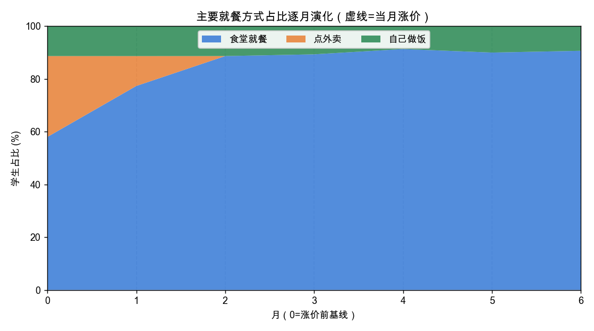
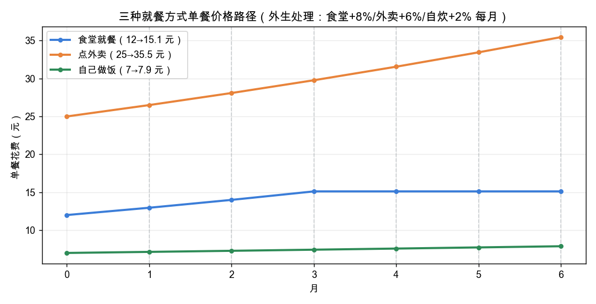
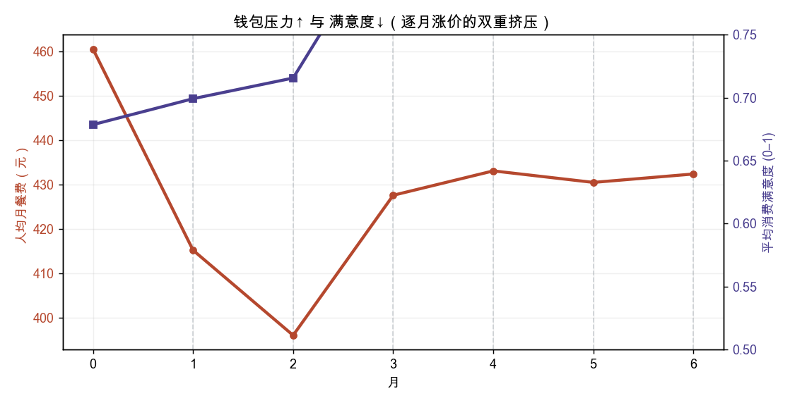
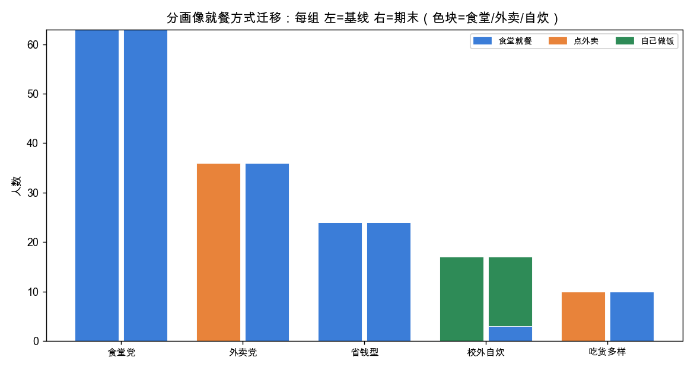

# 大学城学生在食堂逐月涨价与外卖同步涨价下的就餐选择与满意度演化

## ⚠️ 结果可信度声明（务必先读）

本版（每月 3 轮宿舍讨论）的**数值不能作为真实预测**。多轮讨论使 GPT 出现两处系统性失真：
1. **失控从众**：外卖第 2 月即归零、期末 136/150 挤入食堂——讨论每轮放大多数派、逐月锁死，超出现实合理范围。
2. **满意度被“共识”灌水**：期末满意度 **0.935 高于涨价前基线 0.679**（价格更贵却更满意，不可能）；GPT 把“与舍友达成一致”当作满意度来源（理由屡现“舍友一致支持”）。按客观性价比模型，月6满意度应≈**0.67**，被高估约 **+0.28**。

**可保留的真实信号**：第 3 月“食堂封顶”确使食堂价格企稳、带来*部分*真实的满意度缓解（趋势方向成立），但其绝对幅度被讨论共识效应放大。

**方法论价值**：这是“无约束多智能体讨论 → 从众 + 共识偏置”这一 LLM 社会模拟经典陷阱的教科书式演示。修正方向：满意度锚定客观价格/预算/口味（不因共识抬高）、并让 agent 以自身情况为主而非单纯跟风——改提示词后重跑即可。

> 版本：**v1 · 3轮宿舍讨论 + 第3月食堂封顶（结果含讨论失真，见声明）**

## 结论速览

- 追踪 **150 名**固定学生（面板），共 **6 个月**（step 0 为涨价前基线）。
- 就餐方式占比：食堂 58%→91%、外卖 31%→0%（-31pp）、自炊 11%→9%（-2pp）。
- **人均月餐费 461→432 元（-6%）**，平均满意度 0.679→0.935（+0.256）。
- 4 个月累计涨价：食堂 12→15.1 元、外卖 25→35.5 元、自炊 7→7.9 元。

## 主要就餐方式占比演化

| 月 | 食堂 | 外卖 | 自炊 | 平均满意度 | 人均月餐费(元) |
|---|---|---|---|---|---|
| 0（基线） | 58% | 31% | 11% | 0.679 | 461 |
| 1 | 77% | 11% | 11% | 0.699 | 415 |
| 2 | 89% | 0% | 11% | 0.716 | 396 |
| 3 | 89% | 0% | 11% | 0.845 | 428 |
| 4 | 91% | 0% | 9% | 0.901 | 433 |
| 5 | 90% | 0% | 10% | 0.925 | 430 |
| 6 | 91% | 0% | 9% | 0.935 | 432 |

## 价格环境（外生处理）

## 钱包压力与满意度

## 分画像就餐迁移（谁转了、谁没转）

| 画像 | 基线(食堂/外卖/自炊) | 期末(食堂/外卖/自炊) |
|---|---|---|
| 食堂党（常规校内就餐） | 63/0/0 | 63/0/0 |
| 外卖党（重度外卖、图省事） | 0/36/0 | 36/0/0 |
| 省钱型（预算紧、价格敏感） | 24/0/0 | 24/0/0 |
| 校外自炊（有厨房、会做饭） | 0/0/17 | 3/0/14 |
| 吃货多样（重口味、追求多样） | 0/10/0 | 10/0/0 |

## 逐月涨价事件

- **t1**：第1月：食堂餐价上调（×1.08）
- **t1**：第1月：本地外卖客单价上调（×1.06）
- **t1**：第1月：自炊食材价格小幅上涨（×1.02）
- **t2**：第2月：食堂餐价上调（×1.08）
- **t2**：第2月：本地外卖客单价上调（×1.06）
- **t2**：第2月：自炊食材价格小幅上涨（×1.02）
- **t3**：第3月：食堂餐价上调（×1.08）
- **t3**：第3月：本地外卖客单价上调（×1.06）
- **t3**：第3月：自炊食材价格小幅上涨（×1.02）
- **t3**：第3月：食堂宣布餐价封顶，后续不再上调（干预）
- **t4**：第4月：本地外卖客单价上调（×1.06）
- **t4**：第4月：自炊食材价格小幅上涨（×1.02）
- **t5**：第5月：本地外卖客单价上调（×1.06）
- **t5**：第5月：自炊食材价格小幅上涨（×1.02）
- **t6**：第6月：本地外卖客单价上调（×1.06）
- **t6**：第6月：自炊食材价格小幅上涨（×1.02）

## 数据基础与参考来源

| 事实 | 值 | 依据 | 来源 |
|---|---|---|---|
| 中国高校校内食堂一餐(两荤一素套餐)校内价 | 12.0 元/餐 | 实证 | 复旦食堂对外开放报道(套餐约15元菜价);北理工称食堂比外卖便宜 (https://m.gmw.cn/2024-03/11/content_1303682374.htm) |
| 大学生外卖单次消费金额(通常50元以下,常见区间) | 25.0 元/单 | 代理 | 大学生外卖调查:单次消费通常50元以下,77%每周1–5次 (https://k.sina.cn/article_5391043395_14154cb43001011h25.html) |
| 大学生月均餐饮预算(生活费1000–2000元×饮食占比~50%) | 750.0 元/月 | 实证 | 2024中国大学生消费:七成月支出1000–2000元,饮食占生活费约50% (https://news.qq.com/rain/a/20240907A058B900) |
| 有外卖消费行为的学生占比(基线渠道混合参考) | 0.839 占比 | 实证 | 大学生外卖调查:83.9%有外卖行为,77%每周1–5次 (https://k.sina.cn/article_5391043395_14154cb43001011h25.html) |
| 外食价格弹性(堂食比外卖更价格敏感) | 0.75 弹性(绝对值) | 实证 | Andreyeva 2010(FAFH~0.7–0.8);Kilders 2024(堂食>外卖价格敏感) (https://pmc.ncbi.nlm.nih.gov/articles/PMC2804646/) |

**建模参考**

- Kilders et al. (2024) Consumer preferences for food away from home: Dine in versus delivery (AJAE)
- Andreyeva, Long & Brownell (2010) Price Elasticity of Demand for Food: A Systematic Review (AJPH)

**声明的假设**

- 自己做饭单餐食材成本约5–8元,但需额外时间与精力(有隐性成本) — 无直接针对大学生自炊单餐成本的公开统计,按食材价格与常识保守估计;时间/精力成本作为决策阻力项。
- 食堂"逐月上调"与外卖"同期上涨"的具体涨幅(如每月约+5–10%)为情景设定 — 题目给定的假设性政策情景,无对应历史价格序列;涨幅在sv-build-environment作为可调情景参数显式声明,而非真实数据。
- 消费满意度用0–1连续量表(0=很不满意,1=很满意) — 建模刻度选择,便于跨月比较与聚合;非真实测量量表。
- 5 类学生就餐画像及占比——食堂党42%/外卖党24%/省钱型16%/校外自炊11%/吃货7%——为风格化行为细分(非人口学抽样);baseline 主就餐方式混合约 食堂58%/外卖31%/自炊11%。 — 参考外卖渗透率 [[f-delivery-adoption]](83.9% 有外卖行为,但作为"主要"就餐方式占比更低)与月餐饮预算 [[f-monthly-food-budget]](~750元)设定;各画像预算/价格敏感度/做饭可行性区间为课题设计,用于驱动离散选择。未采用 user_pool_survey_mcp——该服务可用但按人口学 marginal 抽样,不含就餐预算/做饭可行性/习惯就餐方式等模型所需字段,且 confirm 计费;按 capability fallback 合成人群。
- 宿舍式随机小组(每组~6人,跨画像混合)+每月3轮组内"倾向+一句话理由"讨论,为建模设定,用于考察社交商议(从众/劝说)对就餐选择的影响。 — 题目要求"每步agent互相讨论3轮再决定";随机分组模拟宿舍;讨论经 MessageBus 在轮次间传递,最后一轮为记录选择。非真实社交网络数据。
- 第3月食堂宣布"涨价封顶":canteen 价格在第3月后不再上调(外卖/自炊照常涨),为中途政策干预情景。 — 题目要求"从中途加干预";基于 [[a-price-schedule]],干预=停止食堂涨价+封顶公告(信息)。多轮交互的研究无法用分支重放继承历史,干预排在第3月一次性跑完整条。