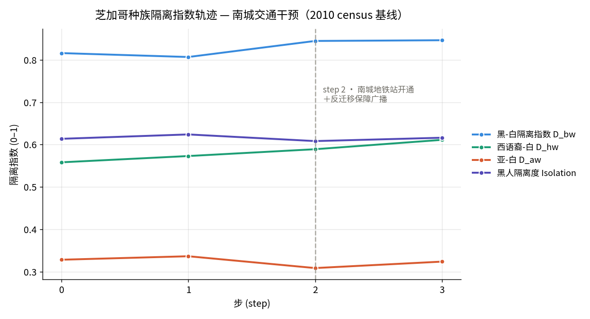
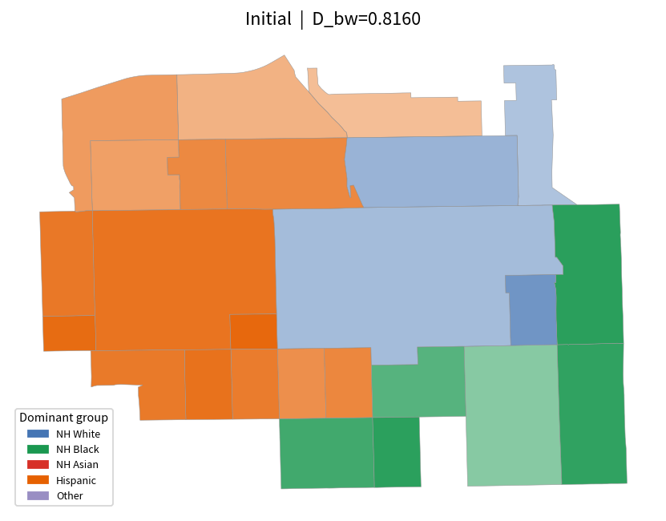
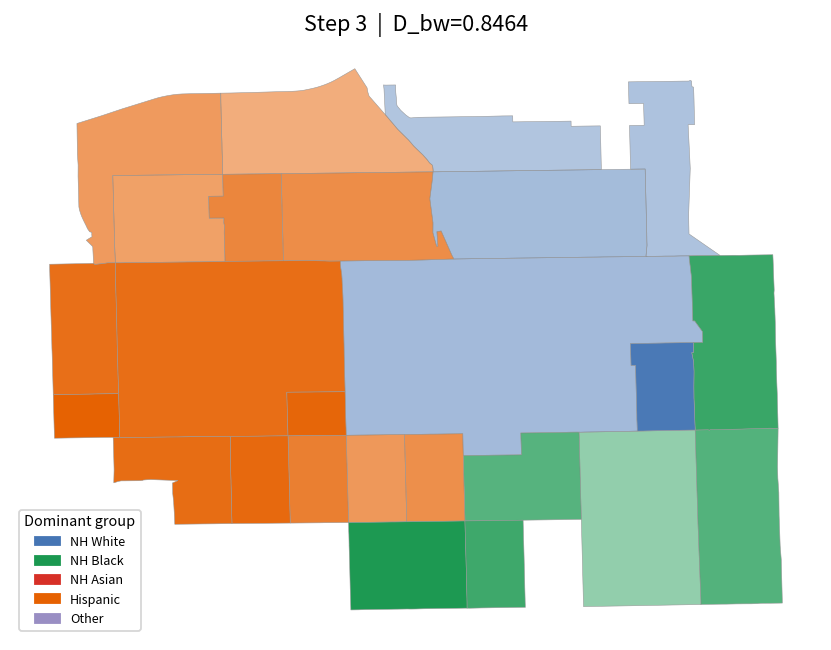

# 芝加哥种族隔离的南城交通干预实验（2010 census 基线 · 参考模板）

> 模式：真实芝加哥人口普查数据（2010）驱动 P 与物理 E · Path-C 遗留缝合（SocioVerse-ABM 内置的遗留 SegregationModel）

## 结论速览

- 追踪 **570 个固定家庭**（2010 普查抽样、按普查区落位）跨 **4 个时间步**（2280 行面板数据）；step 2 在南城 New City 普查区**开通 CTA 地铁站**并配套反迁移保障广播。
- **假设被证伪**：黑-白隔离指数 `D_black_white` 不降反升，从 0.8160 升至 **0.8464**（Δ=+0.0304）——一次性可达性冲击没有带来融合。
- **机制**：车站吸引的是就近的**西语裔流入**（目标区西语裔 0→241 人）而非白人回流（白人 13→0 人），干预从两端同时推高了隔离。
- **系统趋于新均衡**：每步搬迁家庭数 41 → 峰值 50（干预步）→ 31，冲击引发一轮重排序后迁移意愿回落，Schelling 动力学收敛到更隔离的稳态。

## 隔离指数轨迹

| step | D_black_white | D_hispanic_white | D_asian_white | Isolation_black | 搬迁家庭数 |
| --- | --- | --- | --- | --- | --- |
| 0 | 0.8160 | 0.5582 | 0.3282 | 0.6137 | — |
| 1 | 0.8068 | 0.5730 | 0.3364 | 0.6240 | 41 |
| 2（干预） | 0.8447 | 0.5891 | 0.3085 | 0.6083 | 50 |
| 3 | 0.8464 | 0.6112 | 0.3237 | 0.6162 | 31 |

## 空间演化：干预前 vs 期末

## 干预设定（动态环境 E）

- **step 2**：在南城普查区 17031612000（New City）开通 CTA 地铁站（`cta_stations += 2`）。
- **step 2 · 全市广播**：新地铁站开通、直达 Loop 就业区；配套全市公平住房与反迁移保障计划。
- **step 2 · 定向广播**（目标区居民）：家门口的地铁站 + 可负担住房保障，欢迎多元新邻居。

## 发现与解读 (Findings)

- **黑-白隔离不降反升，假设被证伪。** `D_black_white` 从 t=0 的 0.8160 上升到 t=3 的 0.8464（Δ=0.0304，见 figures/metric_timeline.png）。假设预期车站+政策会压低 D_bw，但轨迹显示相反：干预不足以逆转既有的隔离动力学。**机制**：车站开在一个已高度黑人聚居的南城普查区，可达性红利吸引到的是就近的多数群体，而非白人回流——见下一条。
- **干预普查区吸引的是西语裔流入、而非多元化白人回流。** 目标普查区 17031612000 的白人人口从干预前的 13 人降到 t=3 的 0 人，而西语裔从 0 人增至 241 人；黑人存量几乎不变（对比 figures/step_000.png 与 figures/step_003.png 的目标区色块变化）。**机制**：Schelling 决策规则下，可达性提升降低了迁移成本，但迁入方向由同群体邻里份额主导——最邻近的西语裔家庭而非白人抓住了这一机会，使该区更加非白人化，直接推高全市 D_bw。
- **系统在向新均衡收敛，而非持续搅动。** 每步搬迁家庭数从 41 先升到干预步的峰值 50、再回落到 31（t=3）。**机制**：一次性可达性冲击引发一轮重新排序，随后满意度缺口被填平、迁移意愿下降——这是 Schelling 动力学趋于稳态的典型特征，而非隔离被打破。

## 深层洞察 (Deeper insights)

- **两条隔离曲线同向恶化，但驱动群体不同。** `D_black_white`（0.8160→0.8464）与 `D_hispanic_white`（0.5582→0.6112）都在上升，然而前者由白人从南城普查区退出驱动、后者由西语裔在同一批普查区聚集驱动。单看总指数会把两种不同的隔离过程混为一谈——面板数据显示它们是被同一次干预从两端同时放大的。
- **搬迁者越来越"同类相聚"，隔离具有自我强化性。** `mover_alignment_rate`（迁移方向与自身群体多数一致的比例）从 0.220 单调升到 0.387。这意味着干预不仅没有促成混居，反而随时间筛选出更趋同的迁移——一个正反馈的临界（tipping）信号，与 Schelling 经典结论一致。
- **黑人存量对干预免疫、白人高度敏感。** 目标普查区黑人人口在四步内几乎不动，而白人存量被清空——隔离的"黏性"是不对称的：少数主导群体被锁定，边缘的白人少数则率先撤离。要撬动 D_bw，杠杆在留住/吸引白人一侧，而非单纯提升可达性。

## 改进建议与下一步 (Recommendations & next steps)

- **把广播从"反迁移保障"改成"定向吸引"并做 A/B。** 当前政策文本强调可达性与防迁移，却未给白人/多元家庭迁入的正向理由。下一轮 `/sv-iterate` 可新增一条针对全市白人受众的定向广播，对比 D_bw 是否转向下降。
- **对冲击幅度做敏感性扫描。** `cta_stations += 2` 是一次性代理冲击（见声明的假设 a-shock-size）；扫 +1 / +2 / +4 检验结论是否为幅度所驱动，还是无论幅度都会出现"西语裔流入而非白人回流"。
- **选一个已较为混居的普查区重做干预。** 当前目标区起点即高度黑人聚居，白人基数过小、天花板低。换一个 D_bw 处于临界带的普查区，更能检验"可达性冲击能否把临界区推向融合"这一真正的政策问题。
- **延长时间跨度。** 仅 3 步不足以观察一次性冲击后的长期再均衡；把 `n_steps` 提到 6–8 步，看 D_bw 是稳定在更高位还是缓慢回落。本研究包装了既有模拟器，不支持分支重放，延长时程需要从第 0 步整段重跑。

## 数据基础与参考来源

| 事实 | 值 | 依据 | 来源 |
| --- | --- | --- | --- |
| Chicago metro Black-White dissimilarity index, 2010 census | 76 0-100 (D×100) | 实证 | Brown University US2010 Diversity & Disparities — Segregation 2010 (Logan/Stults) (https://s4.ad.brown.edu/projects/diversity/segregation2010/Default.aspx) |
| CTA Red Line Extension — 5.5-mile South-Side rail expansion (95th/Dan Ryan → 130th St) | 5.5 miles | 实证 | CTA — Red Line Extension Project (https://www.transitchicago.com/rle/) |
| Schelling tolerance threshold that still tips a neighbourhood to segregation | 30-50 % same-group neighbours | 实证 | Schelling (1971) + Schelling's Segregation Model: Parameters, scaling, and aggregation (Demographic Research 2009) (https://doi.org/10.4054/demres.2009.21.12) |

**建模参考**
- Schelling, T. (1971) — Dynamic Models of Segregation (https://www.suz.uzh.ch/dam/jcr:00000000-68cb-72db-ffff-ffffff8071db/04.02_schelling_71.pdf) — Agents relocate when the same-group share of neighbours falls below a tolerance threshold; even mild individual preferences (~30-50%) tip neighbourhoods into sharply segregated macro patterns. This is the decision rule the SchellingDecisionModel implements per household.
- Transit-Induced Gentrification: A Quasi-Experimental Analysis of New U.S. Rapid-Transit Stations Opened 2000-2009 (JAPA, 2025) (https://doi.org/10.1177/0739456x251366973) — A new rapid-transit station is a plausibly-exogenous shock to a tract's accessibility; downstream neighbourhood ethnoracial change can go either way (diversifying inflow vs. displacement), motivating the paired anti-displacement broadcast in E and the competing-mechanism framing of the hypothesis.

**声明的假设**
- The intervention station is placed in tract 17031612000 (New City, South Side). — A representative South-Side tract in the small-scale subset; the real RLE terminates further south (130th St). Chosen for demonstration — a plausible South-Side transit-shock site, not a claim that RLE serves this exact tract.
- The station opening is encoded as cta_stations += 2 in the intervention tract at step 2. — No public metric maps a single station opening onto the engine's cta_stations accessibility field; +2 is a deliberate, legible one-off shock large enough to register against the tract's baseline access. Sensitivity to this magnitude is a candidate /sv-iterate sweep.
- The paired citywide + tract broadcasts describe a fair-housing / anti-displacement program. — Stylized policy text, not a specific enacted Chicago ordinance; represents the counter-displacement lever the transit-gentrification literature argues is needed for a station to diversify rather than displace.

> 方法说明：Real-world anchored: 2010-census baseline demographics drive P + physical-E; the step-2 transit intervention is modeled on CTA's real South-Side Red Line Extension. Load-bearing magnitudes (city D_bw baseline, Schelling tolerance regime) are sourced; the specific intervention tract and the +2-station shock size are modeling proxies, declared as assumptions.
