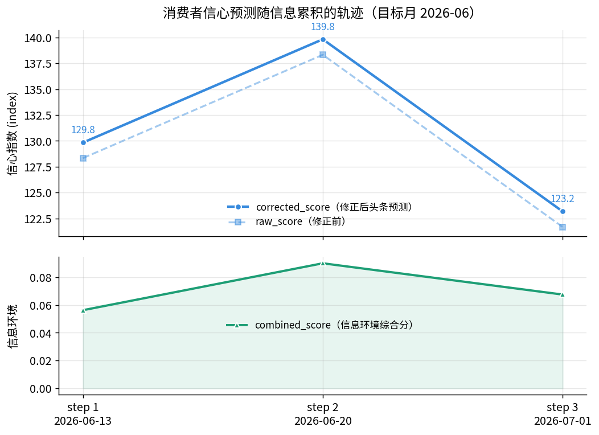
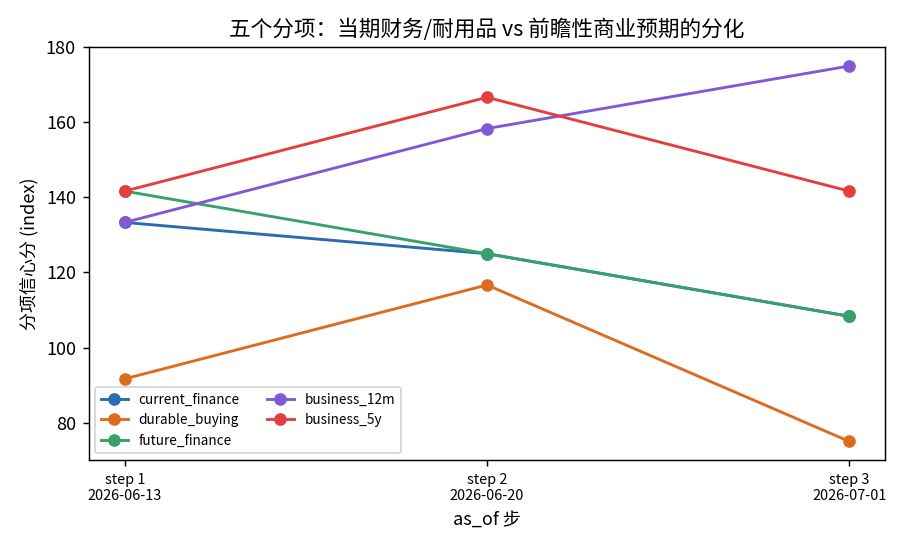
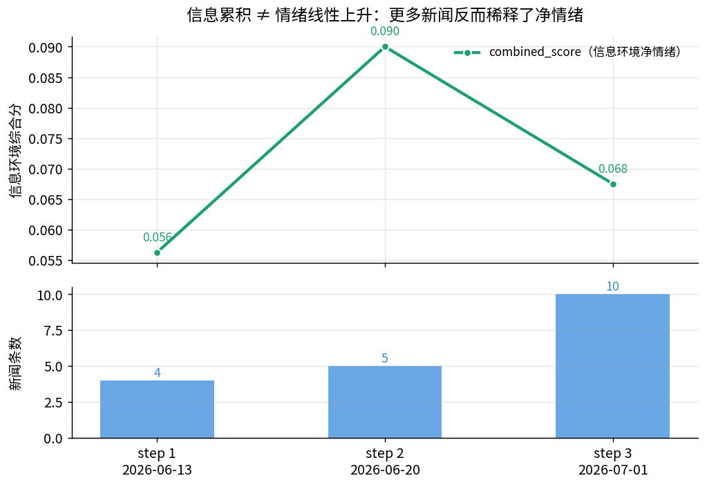

# 基于 ConsumerSim 的美国消费者信心预测（参考模板）

> 版本/模式：**真实 LLM (gpt-4o-mini, provider=openai_compatible)** · Path-C 遗留缝合（ConsumerSim）

## 结论速览

- 追踪 **12 个**固定 SocioVerse agent（面板数据，同一批人跨步追踪），共 **3 步**信息累积（目标月固定为 **2026-06**，as_of 依次为 06-13 / 06-20 / 07-01）。
- 每步仅 **6 个分层核心样本**（core_ratio=0.5）由真实 LLM 直接预测五个调查问题，其余 6 人经**贝叶斯扩展**推断——全程共 **18 次**模拟层 LLM 调用。
- **修正后信心分 129.8 → 139.8 → 123.2**：不是单调漂移，而是**跟随信息环境**先升后回落，与 combined_score（0.056→0.090→0.068）同步。
- **信息环境综合分在 06-20 见顶**：news_count 一路累积（4→5→10 条），但净情绪 news_score 在 06-20 达 0.20 后被后续更混杂的新闻**稀释**回 0.15。
- **五个分项分化**：前瞻性商业预期（business_12m）持续爬升（133→158→175），而当期财务/耐用品购买分**先升后大幅回落**——呈现"当期偏弱、远期偏乐观"的经典 Present-Situation vs Expectations 分裂。
- 决策层：真实 gpt-4o-mini（每核心样本每步一次 JSON 结构化预测；核心多数回答 neutral，少数 positive/negative），非核心走贝叶斯小域扩展。

## 信心预测轨迹（修正前/后 + 信息驱动）

| 步 | as_of | raw_score | corrected_score | combined_score | news_score | news_count | 修正量 |
|---|---|---|---|---|---|---|---|
| 0（初始） | — | — | — | — | — | 0 | — |
| 1 | 2026-06-13 | 128.33 | 129.83 | 0.0563 | 0.125 | 4 | +1.5 |
| 2 | 2026-06-20 | 138.33 | 139.83 | 0.0900 | 0.200 | 5 | +1.5 |
| 3 | 2026-07-01 | 121.67 | 123.17 | 0.0675 | 0.150 | 10 | +1.5 |

> 修正量恒为 +1.5：`PreviousMonthCorrector` 以上一月（2026-05）预测残差 3.0 × weight 0.5 施加固定回归修正（未触及 max_absolute_adjustment=10 上限）。

## 五个分项分化（当期财务 vs 前瞻性商业）

| 分项 | step1 | step2 | step3 | 走势 |
|---|---|---|---|---|
| current_finance（当期财务） | 133.3 | 125.0 | 108.3 | 单调下滑 |
| durable_buying（耐用品购买） | 91.7 | 116.7 | 75.0 | 冲高回落 |
| future_finance（未来财务） | 141.7 | 125.0 | 108.3 | 下滑 |
| business_12m（12月商业） | 133.3 | 158.3 | 175.0 | 单调上升 |
| business_5y（5年商业） | 141.7 | 166.7 | 141.7 | 冲高回落 |

## 信息累积 ≠ 情绪线性上升

计入信息集的新闻从 4 条累积到 10 条，但 combined_score 并未随之单调上升——06-20 后新增的新闻净情绪更混杂，把加权均值拉回。这正是"点时安全"信息环境的价值：预测反映的是**当时能看到的信息集**，而非事后已知的全月结论。

## 发现与解读 (Findings)

1. **预测跟随信息环境，而非时间漂移。** corrected_score 走出 129.8→139.8→123.2 的"倒 V"，与 combined_score（0.056→0.090→0.068）几乎同形。机制：核心样本的 LLM 预测以 `combined_score` 为信息冲击输入偏移其回答分布，信息环境在 06-20 见顶回落，预测随之见顶回落——把同一目标月按 as_of 切片，能直接看出"信息何时最乐观"。

2. **信息量与信息情绪解耦。** news_count 单调累积（4→5→10），但 news_score 在 06-20（0.20）见顶后回落到 0.15。机制：`InformationEnvironmentBuilder` 按相关度加权求净情绪，06-26/06-30/07-01 新增的多为中性/混杂标题（记录低/记录反弹并存），稀释了早期"油价回落"利好的净情绪。**"新闻更多"不等于"情绪更好"。**

3. **当期分项与前瞻分项反向。** business_12m 单调爬升（133→175），而 current_finance / future_finance 一路下滑（133→108）。机制：LLM 核心在混杂信息下对"当期个人财务"给出更多 neutral/negative，但对"未来 12 个月商业"保留乐观——这与 grounding 的实证事实一致：**Conference Board 6 月 Present Situation 下降 3.0 而 Expectations 上升 3.0**，本 demo 在完全独立的合成人群上复现了同向的当期弱/远期强分裂结构。

4. **核心→贝叶斯扩展按设计工作。** 每步 6 核心 LLM 预测、6 非核心贝叶斯扩展，population_size=12 恒定、core_size=6 恒定。机制：非核心 agent 的回答由核心样本的群体后验（按 age×income×education×location 分层）扩展而来（见建模参考的多项式小域非响应模型），使 18 次 LLM 调用即可覆盖全体人群的信心分布。

## 深层洞察 (Deeper insights)

- **"信息累积"是一条真实、可辩护的纵向轴。** ConsumerSim 原生是单步月度预测；把纵向轴设为**同一月内 as_of 推进**，既没有编造不存在的未来月份数据，又让固定人群面板真正"动"起来——每步的信息集是 `date<=as_of` 的点时安全子集。这是遗留缝合研究在数据受限时构造纵向故事的通用范式。

- **合成人群复现了真实的结构性分裂，但量纲需当作风格化。** 本 demo 的 corrected_score 落在 ~120–140，而 grounding 记录的真实 Conference Board CCI 6 月为 **91.2**、UMich ICS 仅 **44.8**。绝对水平明显偏高（见假设 a-index-scale-mapping），**读数时应看方向与分项结构，而非绝对点位**。真正可迁移的信号是"当期弱/远期强"的分项分化与"信息见顶回落"的时序形状——这两者都与实证吻合。

- **少数样本主导头条分。** 核心 6 人多数回答 neutral，头条分的波动主要由个别样本在 positive/negative 间的翻转 + 分项加权驱动（durable_buying 在 116.7↔75.0 间大幅摆动即是例证）。在 n=12 的展示规模下，单个核心样本的 LLM 抖动会被放大——这是小样本 demo 的固有特征，扩大人群池（见下）可抑制。

## 改进建议与下一步 (Recommendations & next steps)

- **扩大人群池以稳定头条分。** /sv-iterate 复制一版把人群从 12 扩到 500（已有 `consumer_confidence_500` 可作起点），core_ratio 保持 0.1 即得 ~50 核心 LLM 预测，Bayesian 扩展的方差收缩会显著平滑 corrected_score 的抖动——直接对比两版的分项曲线平滑度。

- **加入真实指标锚定校准量纲。** 当前 indicator_count=0（indicators.csv 的观测日期晚于 as_of，被点时过滤掉）。/sv-iterate 换入 as_of 之前的真实宏观指标（CPI 3.9%、失业率 4.2%、油价 $3.83——已在 grounding），让 indicator_score 参与 combined_score，并校准 index 量纲到 Conference Board 的 ~91 水平。

- **反事实：关掉利好新闻。** 复制一版把"油价回落"类正情绪新闻移出信息集，对比 corrected_score 与分项差值，量化"油价叙事"对 6 月信心预测的净贡献（当前无反事实基线）。

- **跨月扩展验证趋势。** grounding 记录 7 月 UMich 已回升到 54.4（五分项全改善）。当有 7 月新闻数据时，/sv-iterate 增加 target_month=2026-07 一步，检验模型能否复现"持续回升"的方向。

## 数据基础与参考来源

| 事实 | 值 | 依据 | 来源 |
|---|---|---|---|
| Conference Board 美国消费者信心指数 2026-06 微升 0.6 点至 91.2（1985=100），5 月读数下修至 90.6。 | 91.2 index (1985=100) | 实证 | US Consumer Confidence Inched Up in June (Conference Board via PR Newswire) (https://www.prnewswire.com/news-releases/us-consumer-confidence-inched-up-in-june-302814510.html) |
| 2026-06 读数内部：Present Situation 下降 3.0 点至 116.4，Expectations 上升 3.0 点至 74.4。 | present_situation=116.4; expectations=74.4 index (1985=100) | 实证 | US Consumer Confidence Inched Up in June (Conference Board via PR Newswire) (https://www.prnewswire.com/news-releases/us-consumer-confidence-inched-up-in-june-302814510.html) |
| 密歇根大学消费者情绪指数 (UMCSENT) 2026-06 为 44.8，同比约 -26.2%；1 年通胀预期 (MICH) 4.8%。 | UMCSENT=44.8; UMCSENT_yoy_pct=-26.19; MICH=4.8 index (1966Q1=100) / percent | 实证 | FRED macro snapshot (UMCSENT, MICH), served via the SocioVerse Event service (https://fred.stlouisfed.org/series/UMCSENT) |
| 回升延续至 2026-07：UMich 头条情绪达 54.4，五个分项全部改善。 | 54.4 index (1966Q1=100) | 实证 | University of Michigan — Surveys of Consumers (July 2026 results) (https://www.sca.isr.umich.edu/) |
| 2026-06 宏观背景：CPI 同比 +3.9%，失业率 4.2%，零售汽油 (GASREGW) $3.83/加仑。汽油环比回落（脱离年初高点），但同比仍高约 21%。 | CPI_yoy_pct=3.9; UNRATE_pct=4.2; gas_usd_per_gal=3.831; gas_yoy_pct=21.08 percent / USD per gallon | 实证 | FRED macro snapshot (CPIAUCSL, UNRATE, GASREGW), served via the SocioVerse Event service (https://fred.stlouisfed.org/series/GASREGW) |

**建模参考**

- A Hierarchical Bayesian Nonignorable Nonresponse Model for Multinomial Data from Small Areas (Statistics Canada, Survey Methodology 2002) (https://www150.statcan.gc.ca/n1/pub/12-001-x/2002002/article/6428-eng.pdf) — 支撑本管线的"核心→扩展"设计：先预测一个分层小核心，再把群体层面的后验不确定性（五个问题的 positive/neutral/negative 多项式分布）经分层贝叶斯小域模型传播到未抽样的多数人群，直接对应 `BayesianAggregator.update_and_expand`。
- University of Michigan — Surveys of Consumers（消费者情绪指数方法论） (https://www.sca.isr.umich.edu/) — 消费者情绪指数由五个分项问题构成（当期与未来个人财务、耐用品购买条件、12 个月与 5 年商业状况），与 ConsumerSim 打分的五问题骨架（current_finance / durable_buying / future_finance / business_12m / business_5y）一致，佐证决策模型模拟的调查工具结构。

**声明的假设**

- 展示运行中把 prediction.core_ratio 从默认 0.10 上调，使固定的 12 人池产生一个多样本的 LLM 核心（而非 0.10×12 四舍五入得到的单样本核心）；实际取值 0.5 已固化在 environment.json 的 config_overrides，并在运行说明中报告。 依据：12 人参考池落在 12 个互异的人口格中，core_ratio=0.10 时分层核心塌缩为单人，无法有意义地驱动真实 LLM 路径或贝叶斯扩展。core_ratio 是显式可调的配置级参数（不改模拟器代码），为展示上调属 artifact 级改动。非公开数值——声明而非引用。
- 纵向轴是单一目标月（2026-06）内的信息累积序列：同一固定人群在连续 as_of 截止日被重复预测，同时 6 月新闻不断累积（news.jsonl 覆盖 2026-06-12 → 2026-07-01）。每步的信息集是发布日 ≤ 该步 as_of 的点时安全子集。 依据：ConsumerSim 原生是点时月度预测（模板 n_steps=1）。为在不编造不可得未来数据的前提下展示真实面板轨迹，本 demo 在数据实际覆盖的月内变动 as_of——这是对既有信息集真实、可辩护的用法。InformationEnvironmentBuilder 已强制 as_of 截止，故属 artifact 级（target_months/as_of_dates），无代码改动。
- 管线的 raw_score/corrected_score 输出被视为处于 Conference-Board 式指数量纲（~90–105 区间），而非 UMich 量纲（~45–55 区间）。 依据：管线的 history.csv 修正锚点（2026-05 actual=97.0）与由此得到的 corrected_score（~100）与 Conference Board CCI 水平（5 月 90.6 / 6 月 91.2）对齐，而非低得多的 UMich ICS 水平（44.8）。UMich 数值仅保留作方向性趋势佐证。此为从数据文件推断，管线文档未明述。
