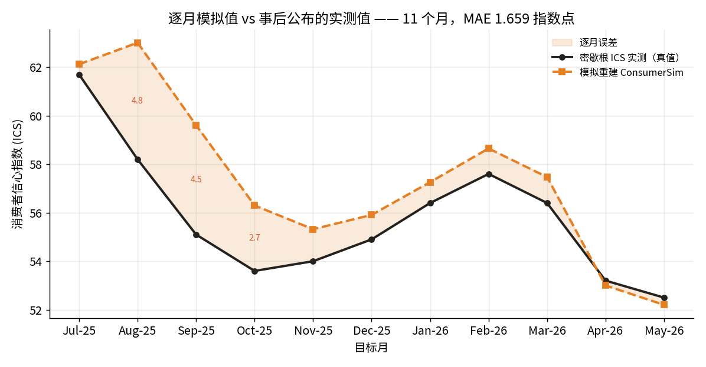
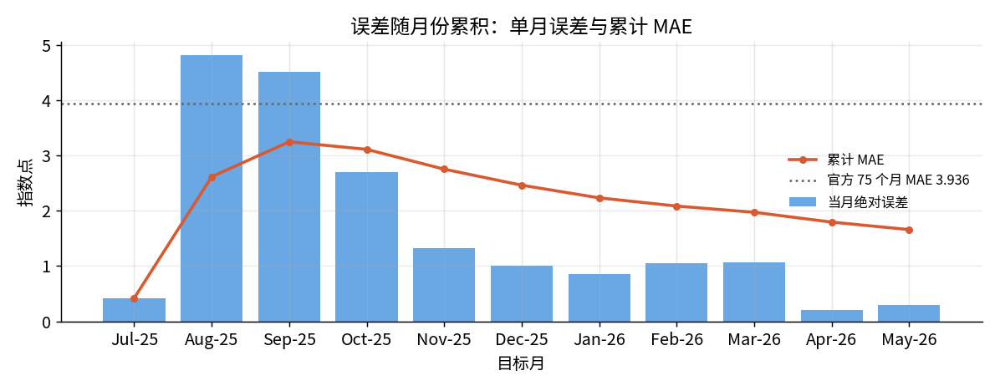
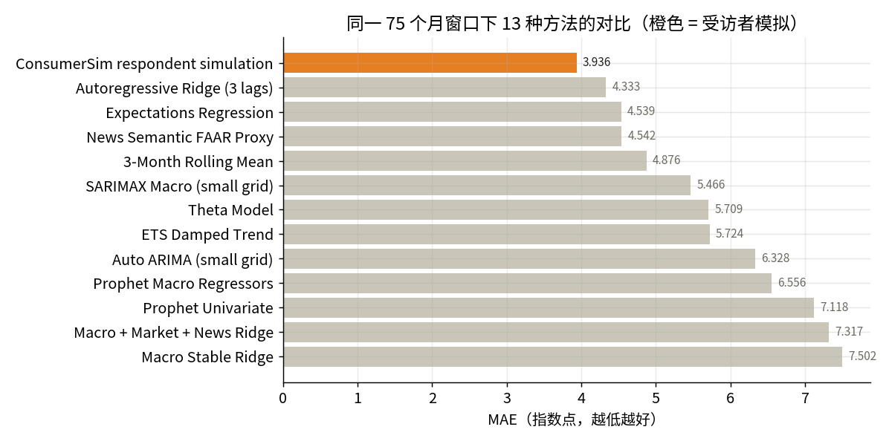
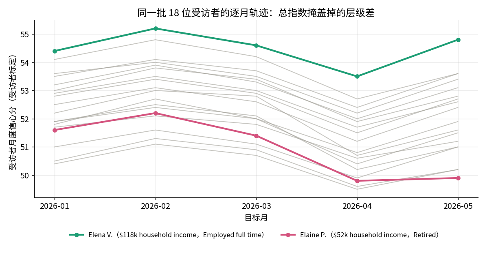

# 美国消费者信心指数回测：逐月模拟值 vs 密歇根大学 ICS 实测

> 形态：**回测导入**（真值对照）· 数据来源：ConsumerSim 公开发布输出 · 真值锚：密歇根大学 Surveys of Consumers 事后公布的 ICS

## 这个案例在演示什么

大多数模拟研究只能说"结果看起来合理"。这一个不一样——它有**事后公布的真实数字可以对答案**。

流程是：把消费者信心指数拆开，还原成一批**有身份、跨月固定不变**的美国家庭；每个月给他们喂当月截止日之前真实可得的信息（宏观指标、通胀预期、就业与物价、融资条件、市场情绪、住房金融、政策与新闻），让他们各自回答密歇根问卷的五道题，再按官方计分规则聚合成指数。**目标月的实测值从不进入输入**。等密歇根大学过些天正式公布该月 ICS，两个数字才被放到一起比对。

新用户建议按这个顺序看：**总览**（研究问题与关键结果）→ **分析实验**（模拟值与实测值同图，横轴是逐月推演步）→ **目标人群**（18 位具名受访者是谁）→ **环境建构**（每月他们能看到什么信息）→ **数据集**（原始逐行数据）。

## 结论速览

- 评分窗 **11 个月（2025-07 → 2026-05）**，逐月都有模拟值与事后实测值成对出现。
- **平均绝对误差 MAE = 1.66 指数点**，RMSE 2.27，与实测序列的 Pearson 相关 0.863。
- **环比方向命中 8 / 10** —— 十次月度转折里对了八次，两次踏空都在开头（2025 年夏秋那轮下滑，模拟侧慢了一拍）。
- 误差**前高后低**：最差的两个月是 2025-08（4.8 点）和 2025-09（4.5 点）；进入 2026 年后单月误差全部 ≤ 1.1 点，最后两个月只差 0.2 / 0.3 点。
- 同一批 **18 位受访者**在 2026-01 → 2026-05 逐月留痕，个体之间的信心水平长期错开约 **5 个点**，而总指数把这层差异完全抹平。

## 逐月对答案

| 步 | 目标月 | 模拟重建 | ICS 实测 | 绝对误差 | 累计 MAE | 面板人数 |
|---|---|---|---|---|---|---|
| 1 | 2025-07 | 62.12 | 61.7 | 0.42 | 0.420 | 0 |
| 2 | 2025-08 | 63.01 | 58.2 | 4.81 | 2.615 | 0 |
| 3 | 2025-09 | 59.61 | 55.1 | 4.51 | 3.247 | 0 |
| 4 | 2025-10 | 56.30 | 53.6 | 2.70 | 3.110 | 0 |
| 5 | 2025-11 | 55.32 | 54.0 | 1.32 | 2.752 | 0 |
| 6 | 2025-12 | 55.91 | 54.9 | 1.01 | 2.462 | 0 |
| 7 | 2026-01 | 57.26 | 56.4 | 0.86 | 2.233 | 18 |
| 8 | 2026-02 | 58.65 | 57.6 | 1.05 | 2.085 | 18 |
| 9 | 2026-03 | 57.47 | 56.4 | 1.07 | 1.972 | 18 |
| 10 | 2026-04 | 53.00 | 53.2 | 0.20 | 1.795 | 18 |
| 11 | 2026-05 | 52.20 | 52.5 | 0.30 | 1.659 | 18 |

## 误差怎么收敛的

累计 MAE 从第 3 步的 3.25 一路降到 1.66。注意虚线：那是 ConsumerSim 官方公布的 **75 个月长窗 MAE 3.936**。本研究这 11 个月明显更准，**这是窗口差异、不是方法改进**——长窗覆盖 2020–2022 的疫情与通胀冲击期，信心指数在那几年剧烈跳动，任何方法的误差都被放大。判断方法水平应看长窗与下面的方法榜。

## 和统计基线比

在同一个 75 个月窗口下与 12 种统计/计量基线对比，受访者模拟法 MAE 3.936 排第 1；最强的统计基线是三阶自回归岭回归（MAE 4.333），随后是预期回归（4.539）与新闻语义代理（4.542）。差距不大但方向一致：**在信心被突发事件推离平滑惯性的月份，逐人重建能跟上，而聚合外推会被平滑掉。**

## 总指数掩盖掉的东西

这是本案例真正的分水岭：官方 ICS 每月只给一个数，而这里可以逐人往下看。18 位受访者跨 5 个月的轨迹几乎平行移动，但**层级常年错开**——科罗拉多的软件产品经理 Elena V.（家庭收入 $118k，全职）稳定在最上沿（2026-05 收在 54.8），佛罗里达的退休者 Elaine P.（$52k，退休）稳定在最下沿（49.9）。两人相差约 5 个点，且 2026-04 那次全体回落中，Elaine 跌得更深、反弹更弱。

**同一个总指数的涨跌，落到不同家庭身上并不是同一件事。** 这正是把宏观指数还原成人群面板的意义：既能对上总量，又能回答"是谁在变、因为什么在变"。

## 口径与边界（务必先读这一节）

1. **这是回测导入，不是本工作台内的重跑。** 指标、受访者画像与逐月面板全部由 `build_from_source.py` 从 ConsumerSim 公开发布的站点数据解析生成，脚本默认读取固定的 2026-07-03 发布版，可逐字节重建（`--latest` 改读当前 CSV，最近几个月可能已被修订）。本研究不分叉、不重跑：要在工作台里真跑一轮 ConsumerSim 管线（会调用真实 LLM、产生新轨迹），请分叉可运行的 `consumer_confidence` 研究（需要 ConsumerSim 兄弟仓），把区域/目标月/信息截止换成你要的窗口。
2. **逐人面板与总指数不在同一标定上，不可直接平均。** 可以自己验证：2026-01 的 18 位受访者均值约 52.4，而同月总指数模拟值是 57.26。因此面板只作为受访者层面的状态展示，**从不参与指标聚合**。
3. **评分窗前 6 个月没有逐人面板**（`panel_size = 0`）。公开数据里的受访者面板只覆盖 2026-01 起的月份，缺的月份保持为空——不补零、不外推、不用邻月顶替。
4. **11 个月的样本量很小。** MAE 1.66 是这段相对平稳时期的读数，不要外推成方法的通用精度。

## 想接着做什么

- **换个窗口再回测。** 分叉 `consumer_confidence`，把回测窗口换成 2020-01 至 2022-12，看方法在冲击期的表现——那正是长窗 MAE 被拉高的地方。
- **换个地区。** 同一套管线还发布了 EU27（MAE 1.607 / Pearson 0.882）与日本（1.35 / 0.813）的回测——在 `consumer_confidence` 的分叉里把区域换掉，就能在同一套指标下横向比三个地区的重建难度。
- **做反事实。** 在 `consumer_confidence` 的分叉里把某个月的利好新闻移出信息集，看逐人回答与总指数各自变了多少——这是回测形态直接升级成因果问题的路径。
