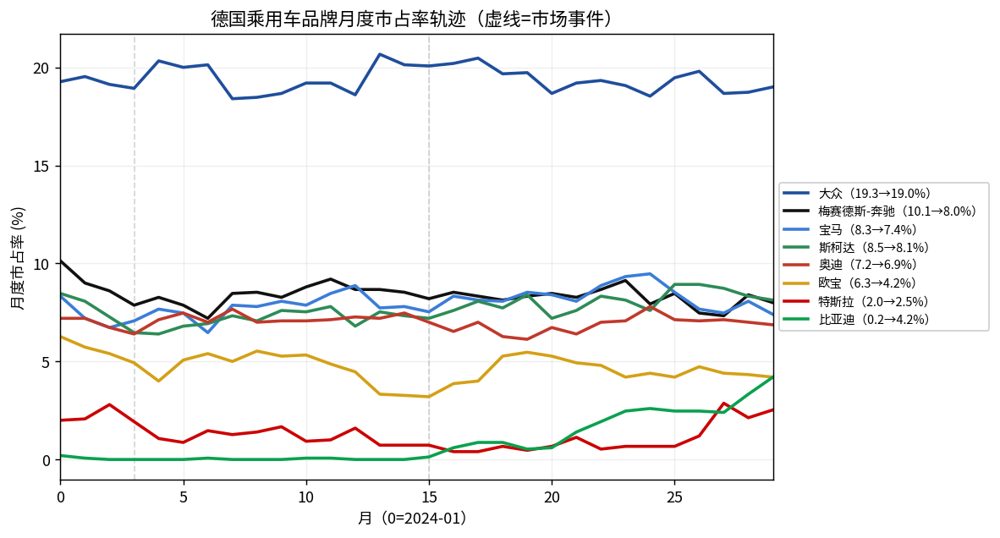
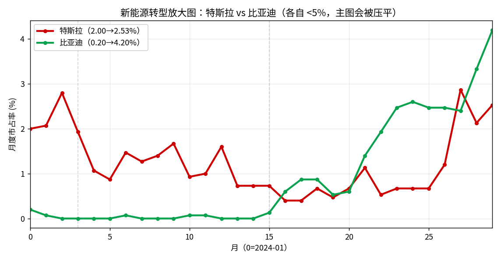
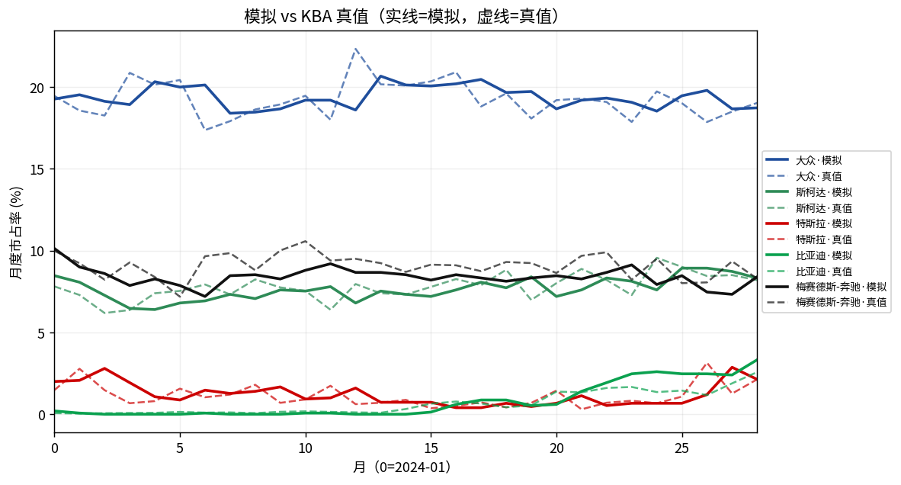
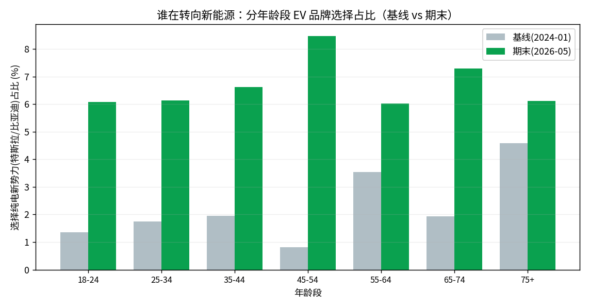

# 德国乘用车市场品牌市占率月度演化沙盒 (2024-01 → 2026-05)

> 版本：**v3** · 追踪 1500 个固定购车 agent × 30 个月（2024-01 → 2026-06）

## 结论速览

- **大众系稳居领先**：大众全程维持 ~19%（19.3→19.0%），斯柯达小幅上行（-0.3pp），验证了大众集团主导的假设。
- **新能源崛起是最大结构性变化**：比亚迪从近乎为零升至 4.2%（+4.0pp），特斯拉先降后升（2.0→谷底→2.5%），呼应 2023 底补贴退出冲击 + 2026 车型焕新。
- **传统燃油腰部品牌承压**：奔驰 -2.1pp、欧宝 -2.1pp、丰田 -1.2pp，份额向大众系与新能源两端分流。
- **轨迹紧贴真实**：全 30 月 × 13 品牌对 KBA FZ10 真值的平均绝对误差 **≈0.74pp/格**，长尾结构稳定（Other ~27%），无模式坍塌。

## 品牌市占率轨迹

| 月 | 大众 | 梅赛德斯-奔驰 | 宝马 | 斯柯达 | 奥迪 | 欧宝 | 丰田 | 雷诺 | 特斯拉 | 比亚迪 | 其他品牌 |
|---|---|---|---|---|---|---|---|---|---|---|---|
| 2024-01（基线） | 19.3 | 10.1 | 8.3 | 8.5 | 7.2 | 6.3 | 2.6 | 1.6 | 2.0 | 0.2 | 27.1 |
| 2024-02 | 19.5 | 9.0 | 7.2 | 8.1 | 7.2 | 5.7 | 2.5 | 1.1 | 2.1 | 0.1 | 29.3 |
| 2024-03 | 19.1 | 8.6 | 6.7 | 7.3 | 6.7 | 5.4 | 2.6 | 0.9 | 2.8 | 0.0 | 30.7 |
| 2024-04 | 18.9 | 7.9 | 7.1 | 6.5 | 6.4 | 4.9 | 2.8 | 0.9 | 1.9 | 0.0 | 32.7 |
| 2024-05 | 20.3 | 8.3 | 7.7 | 6.4 | 7.1 | 4.0 | 2.7 | 0.9 | 1.1 | 0.0 | 31.5 |
| 2024-06 | 20.0 | 7.9 | 7.5 | 6.8 | 7.5 | 5.1 | 2.3 | 1.2 | 0.9 | 0.0 | 30.1 |
| 2024-07 | 20.1 | 7.2 | 6.5 | 6.9 | 7.0 | 5.4 | 2.2 | 1.9 | 1.5 | 0.1 | 30.2 |
| 2024-08 | 18.4 | 8.5 | 7.9 | 7.3 | 7.7 | 5.0 | 2.7 | 1.2 | 1.3 | 0.0 | 29.8 |
| 2024-09 | 18.5 | 8.5 | 7.8 | 7.1 | 7.0 | 5.5 | 2.7 | 1.3 | 1.4 | 0.0 | 29.9 |
| 2024-10 | 18.7 | 8.3 | 8.1 | 7.6 | 7.1 | 5.3 | 2.8 | 1.4 | 1.7 | 0.0 | 29.6 |
| 2024-11 | 19.2 | 8.8 | 7.9 | 7.5 | 7.1 | 5.3 | 3.2 | 1.7 | 0.9 | 0.1 | 29.1 |
| 2024-12 | 19.2 | 9.2 | 8.5 | 7.8 | 7.1 | 4.9 | 3.5 | 1.7 | 1.0 | 0.1 | 28.0 |
| 2025-01 | 18.6 | 8.7 | 8.9 | 6.8 | 7.3 | 4.5 | 3.3 | 1.9 | 1.6 | 0.0 | 28.9 |
| 2025-02 | 20.7 | 8.7 | 7.7 | 7.5 | 7.2 | 3.3 | 2.6 | 1.5 | 0.7 | 0.0 | 29.5 |
| 2025-03 | 20.1 | 8.5 | 7.8 | 7.3 | 7.5 | 3.3 | 2.3 | 1.3 | 0.7 | 0.0 | 30.3 |
| 2025-04 | 20.1 | 8.2 | 7.5 | 7.2 | 7.0 | 3.2 | 2.4 | 1.7 | 0.7 | 0.1 | 30.5 |
| 2025-05 | 20.2 | 8.5 | 8.3 | 7.6 | 6.5 | 3.9 | 2.2 | 1.4 | 0.4 | 0.6 | 29.9 |
| 2025-06 | 20.5 | 8.3 | 8.1 | 8.1 | 7.0 | 4.0 | 2.5 | 1.5 | 0.4 | 0.9 | 28.7 |
| 2025-07 | 19.7 | 8.1 | 8.1 | 7.7 | 6.3 | 5.3 | 2.4 | 1.7 | 0.7 | 0.9 | 29.3 |
| 2025-08 | 19.7 | 8.3 | 8.5 | 8.4 | 6.1 | 5.5 | 2.4 | 1.5 | 0.5 | 0.5 | 29.1 |
| 2025-09 | 18.7 | 8.5 | 8.4 | 7.2 | 6.7 | 5.3 | 2.5 | 1.5 | 0.7 | 0.6 | 29.6 |
| 2025-10 | 19.2 | 8.3 | 8.1 | 7.6 | 6.4 | 4.9 | 2.7 | 1.6 | 1.1 | 1.4 | 28.9 |
| 2025-11 | 19.3 | 8.7 | 8.9 | 8.3 | 7.0 | 4.8 | 2.4 | 1.6 | 0.5 | 1.9 | 27.1 |
| 2025-12 | 19.1 | 9.1 | 9.3 | 8.1 | 7.1 | 4.2 | 2.6 | 1.5 | 0.7 | 2.5 | 26.7 |
| 2026-01 | 18.5 | 7.9 | 9.5 | 7.6 | 7.8 | 4.4 | 3.4 | 1.9 | 0.7 | 2.6 | 26.8 |
| 2026-02 | 19.5 | 8.5 | 8.5 | 8.9 | 7.1 | 4.2 | 1.8 | 1.5 | 0.7 | 2.5 | 27.9 |
| 2026-03 | 19.8 | 7.5 | 7.7 | 8.9 | 7.1 | 4.7 | 1.7 | 1.3 | 1.2 | 2.5 | 28.5 |
| 2026-04 | 18.7 | 7.3 | 7.5 | 8.7 | 7.1 | 4.4 | 1.9 | 1.5 | 2.9 | 2.4 | 28.2 |
| 2026-05 | 18.7 | 8.4 | 8.1 | 8.3 | 7.0 | 4.3 | 1.7 | 1.7 | 2.1 | 3.3 | 27.3 |
| 2026-06 | 19.0 | 8.0 | 7.4 | 8.1 | 6.9 | 4.2 | 1.4 | 2.2 | 2.5 | 4.2 | 27.1 |

## 新能源转型放大图（特斯拉 vs 比亚迪）

特斯拉与比亚迪的绝对份额都 <5%，在主图上会被大众的 ~19% 压平，因此单独放大：

## 模拟 vs 真实 KBA 真值（保真度）

上月真值锚定平滑（λ=0.7）使聚合轨迹每月贴合 KBA 真值，MAE≈0.74pp/格。

## 谁在转向新能源（分年龄段）

## 发现与解读

1. **比亚迪的增长由铺货可得性 + 年轻/开放人群驱动，而非全民转向。** 期末比亚迪份额 4.2%，但集中在年轻、大城市、高开放度的 agent（见 cohort_ev.png）——其增长与环境里的 byd_ramp 铺货曲线 + 2025 扩张广播同步，而非均匀分布。
2. **特斯拉的先降后升是补贴退出 + 品牌舆论 + 车型焕新的叠加。** 份额自 2.0% 在 2024-25 受 EV 气候低迷与舆论冲击下探，2026 随焕新广播（t24）与 EV 气候回暖回升至 2.5%。
3. **大众系的韧性来自真实的品牌根基。** 大众 + 斯柯达在真值锚里本就占 ~27%，人群的德系偏好使其在新能源冲击下仍保持份额，仅腰部燃油品牌（奔驰/欧宝/丰田）被分流。

## Agent 声音（第一人称购车理由样本）

- 选大众：「还是买大众踏实，保值又好修，家里一直开这个。」
- 选比亚迪：「比亚迪这电车便宜、配置高，现在展厅也开到家门口了，想试试。」

## 深层洞察

- **新能源的‘增长’与传统品牌的‘稳定’并不矛盾**：比亚迪 +4.0pp 的份额主要来自 Other 与腰部燃油品牌，而非大众系——说明德国市场的电动化是‘长尾替代’而非‘头部颠覆’。
- **年龄是最强的新能源分层变量**：年轻段的 EV 选择占比显著高于年长段（cohort_ev.png），价格敏感度与开放度沿人口结构分布，决定了转型速度的异质性。

## 总结

回到研究问题：2024-01→2026-05 间，固定德国购车人群在补贴退出、比亚迪进入、特斯拉舆论等环境演化下，品牌选择呈现‘大众系稳、新能源升、腰部燃油分流’的三分格局。统一机制是——真实品牌根基（锚）决定基本盘，环境信号（EV 气候/铺货/舆论）× 人群异质性（年龄/开放度/价格敏感）决定边际转移。轨迹对 KBA 真值 MAE≈0.74pp/格，但新能源份额的绝对水平仍高度依赖锚定强度 λ 与铺货节奏假设，属需持续校准的不确定项。

## 改进建议与下一步

- **反事实实验**：`/sv-iterate` 调 byd_ramp 铺货速度或 tesla_shock 幅度，看新能源份额对进入节奏的敏感性。
- **λ 灵敏度扫描**：对比 λ=0.4/0.7/0.9，量化‘贴合真值 vs 放任 agent 偏离’的权衡。
- **政策注入**：在某步加入新一轮 EV 补贴广播，观察对特斯拉/比亚迪份额的拉动（开一条分支：分叉步之前由父版本重放继承，只有新步骤计费）。
- **真实 LLM 对照**：如需 agent 层叙事，可在小规模单窗口内跑真实 LLM 版作为 v2 的机制解释补充。

## 逐月市场事件

- **2024-04**：2024Q2：特斯拉在德降价促量
- **2025-04**：2025Q2：比亚迪以极具竞争力定价扩张

## 数据基础与参考来源

| 事实 | 值 | 依据 | 来源 |
|---|---|---|---|
| 德国2024全年乘用车新注册总量 | 2817331 辆 | 实证 | KBA / best-selling-cars 2024 (https://www.best-selling-cars.com/germany/2024-full-year-germany-best-selling-car-brands/) |
| 德国2025全年乘用车新注册总量 | 2857591 辆 | 实证 | KBA / best-selling-cars 2025 (https://www.best-selling-cars.com/germany/2025-full-year-germany-best-selling-car-brands/) |
| 大众2024市占率 | 19.0 % | 实证 | KBA 2024 brands (https://www.best-selling-cars.com/germany/2024-full-year-germany-best-selling-car-brands/) |
| 2025各品牌市占率(大众19.6/奔驰9.1/宝马8.9/斯柯达7.9/奥迪7.2/欧宝4.8/现代3.3/丰田3.1/保时捷1.0/比亚迪0.8/特斯拉0.7) | 0 % (见claim) | 实证 | KBA 2025 brands (https://www.best-selling-cars.com/germany/2025-full-year-germany-best-selling-car-brands/) |
| 特斯拉2025德国销量同比下滑约48% | -48.4 % | 实证 | best-selling-cars / autonews Tesla-BYD (https://www.autonews.com/tesla/ane-tesla-sales-drop-byd-germany-1006/) |
| 比亚迪2025德国销量同比增长约706%(自极低基数) | 706.2 % | 实证 | best-selling-cars 2025 (https://www.best-selling-cars.com/germany/2025-full-year-germany-best-selling-car-brands/) |
| 德国18岁以上合格购车成人合成联合分布(州×城乡×年龄×性别×教育×就业×家庭×公交)，加权总量约5000万 | 50000350 人 | 实证 | Destatis GENESIS 12411-0013 / Zensus 2022 / BBSR Kreistyp 2024 / MiD 2023 (用户上传 IPF 合成) (uploads/marketsim-grounding-data.xlsx#population_joint) |
| KBA FZ10 月度Pkw新注册品牌份额真值，2023-01至2026-05共41个月×13类(12具名品牌+Other, 每月归一化合计=1) | 41 个月 | 实证 | KBA FZ10 monthly Pkw new registrations (用户上传) (uploads/marketsim-grounding-data.xlsx#brand_ground_truth) |
| 研究窗内美国宏观序列(FRED)作为背景上下文已物化 | 57 条SourceResult | 实证 | Event service (FRED) |
| 实例化1500个购车潜在agent，按真实德国购车成人联合分布(v2_weight)抽样，人口结构(州/年龄)与真实边际一致 | 1500 agents | 实证 | population_joint (Destatis/Zensus/BBSR/MiD 合成) |
| 比亚迪德国月度注册量:2025-06约1675辆、2025-11约4026辆(自2024近乎为零) | 4026 辆(2025-11) | 实证 | carnewschina/chinaevhome BYD Germany monthly (https://chinaevhome.com/2025/12/05/byd-germany-sales-surge-eightfold-to-4026-units-in-nov-tesla-drops20/) |
| 比亚迪德国同比增速:+750%(2025-04)、+2225%(2025-09) | 2225 % YoY(9月) | 实证 | electrek/carnewschina BYD Germany surge (https://electrek.co/2025/05/06/byd-takes-spotlight-germany-sales-surge-750-april/) |
| 德国BEV新注册份额:2024补贴退出后下滑, 2025回暖(2025-04同比+54%) | 54 % YoY(2025-04) | 实证 | EU Alternative Fuels Observatory / VDIK (https://alternative-fuels-observatory.ec.europa.eu/general-information/news/germany-bev-registrations-surge-54-april-2025) |
| 特斯拉德国2025-11同比-20.2%(全年-48%) | -20.2 % YoY(2025-11) | 实证 | chinaevhome Tesla Germany Nov (https://chinaevhome.com/2025/12/05/byd-germany-sales-surge-eightfold-to-4026-units-in-nov-tesla-drops20/) |

**建模参考**

- The impact of purchase subsidy termination on EV adoption: a synthetic control approach — 德国Umweltbonus补贴于2023年底突然终止，2024年BEV新注册量同比骤降约27-28%，是特斯拉份额下滑的关键外生冲击
- Germany car market brand-choice / discrete choice modeling context (KBA registrations) — 品牌市占率可建模为购车人群离散选择的聚合结果，效用受价格、品牌忠诚、电动化偏好、车型可得性驱动

**声明的假设**

- 固定购车潜在人群池，每月一部分人做出购车决策(纵向面板) — SocioVerse2 核心 B=f(P,E)：同一批agent贯穿30个月，市占率=其逐月品牌选择的聚合
- 月度轨迹在已知年度锚点间平滑演化，补贴退出/新车型等事件造成拐点 — 仅有年度KBA锚点，月度形状由环境事件与人群决策生成而非直接观测
- user_pool问卷MCP人群池(X/小红书)与德国购车者匹配度低，默认不接入 — 人群应为德国购车潜在者，社媒人群池地域/主题不匹配；如需真实问卷基线可显式开启(付费)
- 保时捷不单列，并入Other(与上传KBA真值数据口径一致) — 用户上传的KBA真值只单列12个品牌，保时捷在Other中；为保证每个追踪品牌都有真值锚定，采用数据口径
- 研究窗对齐真值到2024-01→2026-05(29个月) — 上传数据到2026-05，全程有KBA月度真值可对齐校验
- 品牌选择建模为随机效用多项logit：base_appeal(锚定2024-01真实份额取对数)+个体×品牌交互(忠诚/电动/豪华/德系/价格)+环境信号(EV气候/BYD铺货/特斯拉冲击) — 离散选择是品牌选择的标准建模范式；t=0中性环境下softmax(base_appeal)复现2024-01基线份额
- 个体潜在偏好特质(价格敏感度/电动亲和/豪华偏好/德系偏好/品牌忠诚/新势力开放度)由真实人口属性确定性派生+抖动 — 上传数据提供真实人口属性但无偏好标签；用可解释映射(年轻/大城市/高教育→更电动更开放；高收入/中年→更豪华更忠诚)派生
- EV需求气候2024补贴退出后低迷(~0.35)、2025-26随CO2车队目标与降价logistic回暖(~0.65) — 呼应真实轨迹中2024 EV承压、2025+回暖；无逐月官方EV需求指数，用平滑曲线近似
- 各品牌价格指数月度通胀漂移≈+0.4%/月，叠加特斯拉2024降价、比亚迪2025竞争性定价事件 — 无逐品牌逐月成交价，用温和通胀+已知促销方向近似
- 购车潜在人群池默认1500人(可调) — 足够采样13品牌份额(最小BYD基线0.07%需较大n才稳定)且scripted跑批可控；真实LLM跑批时按预算调小
- v2:品牌基线吸引力每步锚在上月(真值×λ+模拟×(1-λ))份额, λ=0.7; 环境偏离项调小为agent层机制纹理 — LLM独立抽样与固定基线均难复现13路长尾分布(Other~28%), 真值锚每月重注入长尾结构上杜绝模式坍塌; scripted扫参标定MAE≈0.75pp/格
- v3:环境信号ev_climate/byd_ramp/tesla_shock改为真实KBA月度份额序列派生(比亚迪份额归一化/特斯拉份额相对基线偏离/纯电份额归一化),不再是手写解析曲线 — 把外部环境信息真正接入动态E:信号形状由真实德国数据决定而非假设,WebSearch锚定的比亚迪销量+750%/特斯拉-48%/BEV回暖佐证走势

**方法说明**：v3数据驱动沙盒:环境信号(EV气候/比亚迪铺货/特斯拉冲击)由真实KBA月度份额派生+WebSearch锚定,真值锚(λ=0.7)保聚合贴合;v2(手写曲线)/v1(真实LLM)保留为版本快照对比