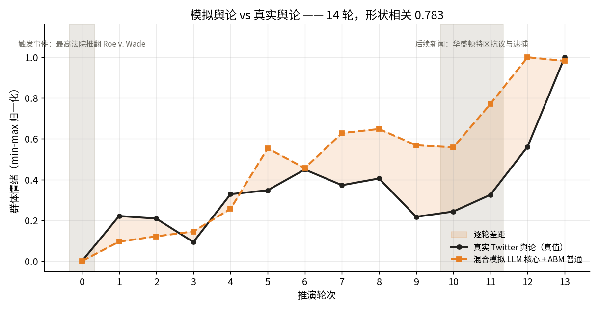
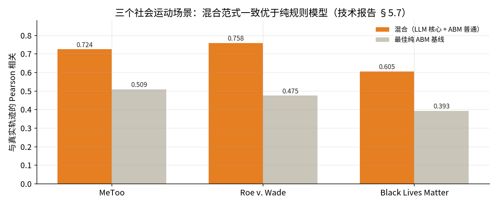
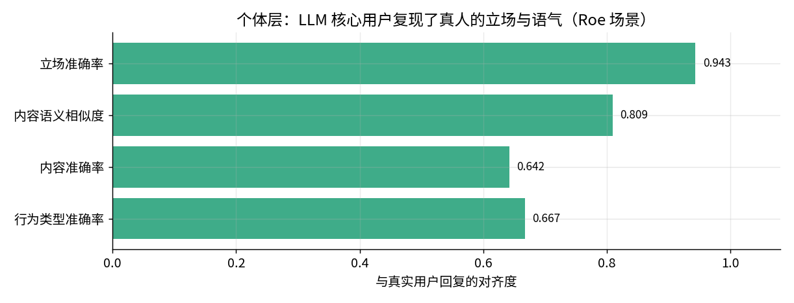

# HiSim 混合社会运动舆论动态：Roe v. Wade 事件后的模拟舆论 vs 真实舆论

> 形态：**技术报告 case 导入**（真值对照）· 数据来源：SocioVerse2 技术报告 §5.7（图表源码逐点数字化）· 真值锚：同期真实 Twitter 群体情绪

## 这个案例在演示什么

一起触发性事件之后，社交媒体舆论会怎么走？这个 case 的特别之处在于：**它拿模拟结果去和真实发生过的舆论曲线对答案**。

难点是规模。纯 LLM 模拟在社交媒体所需的人群规模上贵得跑不起，纯 ABM 又生成不出意见领袖真正说了什么。**混合范式**的做法是分工：少量「核心用户」由 LLM 驱动（真实 Twitter 画像 + 个人记忆 + 关注关系），海量「普通用户」由经典舆论动力学规则驱动（有界信心 / Hegselmann–Krause / Lorenz / 相对一致 / 社会判断，可换）；两侧通过**镜像机制**耦合——ABM 侧为每个 LLM agent 维护一份镜像，每轮用 LLM agent 实际发文的情感覆盖其态度值，于是话语能真正带动人群，人群也反过来构成 LLM agent 看到的时间线。

新用户建议按这个顺序看：**总览** → **分析实验**（模拟与真实两条曲线同图）→ **环境建构**（每轮注入了什么真实新闻）→ **目标人群**（核心/普通两层是怎么配的）。

## 结论速览

- **14 轮**逐轮对照，模拟曲线与真实曲线的**形状相关 0.783**（数字化重算值；论文对该配置公布的口径是 **0.758**，差异来自数字化误差，两个数都列在这里）。
- **混合范式一致优于纯规则模型**：Roe 场景下最佳纯 ABM 只到 **0.475**，混合（Lorenz）到 **0.758**；MeToo 0.509 → 0.724，BLM 0.393 → 0.605。三个社会运动无一例外。
- **绝对水平也没跑偏**：ΔBias 0.009（纯 ABM 0.033）。形状对得上、量级也对得上。
- **个体层同样对齐**：LLM 核心用户复现真实用户的**立场准确率 0.943**、内容语义相似度 0.809、行为类型准确率 0.667 —— 群体层的吻合不是靠个体层的乱猜互相抵消得来的。
- **两次真实新闻注入都有响应**：第 0 轮的推翻判决、第 10–11 轮的华盛顿特区抗议与逮捕，模拟曲线都跟着抬升。

## 逐轮对答案

| 轮次 | 模拟 | 真实 | 差距 | 累计相关 | 新闻注入 |
|---|---|---|---|---|---|
| 0 | 0.000 | 0.000 | 0.000 | — | ● 推翻 Roe v. Wade |
| 1 | 0.095 | 0.221 | 0.126 | — |  |
| 2 | 0.121 | 0.208 | 0.087 | 0.967 |  |
| 3 | 0.145 | 0.093 | 0.052 | 0.631 |  |
| 4 | 0.256 | 0.328 | 0.072 | 0.830 |  |
| 5 | 0.553 | 0.347 | 0.206 | 0.785 |  |
| 6 | 0.456 | 0.449 | 0.007 | 0.841 |  |
| 7 | 0.628 | 0.372 | 0.256 | 0.830 |  |
| 8 | 0.648 | 0.405 | 0.243 | 0.847 |  |
| 9 | 0.568 | 0.217 | 0.351 | 0.763 |  |
| 10 | 0.558 | 0.243 | 0.315 | 0.724 | ● 特区抗议与逮捕 |
| 11 | 0.771 | 0.325 | 0.446 | 0.703 | ● 特区抗议与逮捕 |
| 12 | 1.000 | 0.561 | 0.439 | 0.793 |  |
| 13 | 0.982 | 1.000 | 0.018 | 0.783 |  |

模拟侧整体**跑在真值前面**：中段（第 5–11 轮）系统性偏高，说明 LLM 核心用户对事件的反应比真实人群更快也更持续。真实舆论在第 9 轮有一次明显回落，模拟只是走平——**这是这个 case 最值得看的一处失配**，累计相关也正是从这里由 0.847（第 8 轮）滑到 0.703（第 11 轮）。第 11 轮真实新闻注入后两条曲线重新收敛，累计相关回到 0.783，末轮差距只剩 0.018。

## 混合 vs 纯规则：三个社会运动都一样

这是混合范式的核心论据：把意见领袖交给 LLM，人群规模交给规则模型，**三个场景的轨迹相关全部显著高于最佳纯 ABM 基线**。提升幅度 0.21–0.28，且不是靠某一个场景撑起来的。五种可互换的 ABM 模型让"哪种经典机制最适合配合 LLM 核心用户"成为一个可系统消融的问题——Roe 场景是 Lorenz，MeToo 与 BLM 是相对一致（RA）。

## 个体层：群体吻合不是碰巧

单轮回复实验里，LLM 核心用户以 **0.943** 的准确率复现了对应真人的立场，内容语义相似度 **0.809**。这一层很关键：如果个体层是乱猜，群体层的吻合就只能是误差互相抵消的巧合，换个场景立刻失效。三个场景的立场准确率都在 0.899 以上。

## 口径与边界（务必先读这一节）

1. **这是 case 导入，不是本工作台内的重跑。** 两条曲线由 `build_from_techreport.py` 从技术报告的图表源码（`fig_hisim_trajectories.tikz`）逐点提取，脚本会**回读 tikz 校验全部 28 个坐标**，改了任一侧而另一侧没跟上就直接报错。上游是 HiSim 论文（Mou et al., ACL 2024 Findings）的代表性运行。
2. **归一化，不是绝对值。** 两条序列各自 min–max 归一化到 [0,1]——这是技术报告的口径，因为两者绝对量程不重叠，评估看的是轨迹形状。绝对水平的吻合另有其数（ΔBias 0.009），取自论文表格。
3. **相关系数有两个。** 数字化重算 0.783，论文公布 0.758。报告里凡是说"本 case 的相关"都指前者，凡是引用论文结论都指后者，不混用。
4. **没有逐人面板。** 论文只公开聚合轨迹，个体层证据是上面那张对齐表，不是逐人序列。所以"分析实验"里没有个体下钻——缺的东西留空，不编。
5. **环比方向只命中 7/13。** 形状相关高、但逐轮涨跌同向率一般，说明吻合主要来自趋势段而非每一轮的抖动。小样本 14 轮，别过度解读。

## 本工作台内跑过的那一版（保留记录）

这个 study 早先在 SocioVerse Core 上做过一版**真实的从零移植**并跑通：20 个固定 agent（8 核心 LLM + 12 普通 ABM），4 步，真实 gpt-4o-mini。结果是群体偏移 bias −0.2223 → −0.1590，态度多样性 0.3216 → 0.1908（收敛），核心用户均值 −0.1112 → +0.0653 而普通用户几乎不动（−0.2964 → −0.3085）——**两类用户分道，正是镜像耦合还没来得及把话语传导下去的样子**。

移植代码 `model.py` / `reporting.py` 原样保留，要真跑就以它们为模板新建研究；那一版的数字即上文所列。

## 想接着做什么

- **换场景。** `python build_from_techreport.py metoo`（或 `blm`），三套序列都在脚本里；MeToo 的失配点与 Roe 完全不同，值得对照看。
- **换普通用户的规则。** 五种经典模型可互换，做一轮消融，看哪种机制在你关心的事件类型上最配得上 LLM 核心用户。
- **补上第 9 轮那次回落。** 真实舆论掉、模拟没掉——去查那一轮真实世界发生了什么、当前信息环境里缺了哪条，这是把"拟合"变成"解释"的入口。
