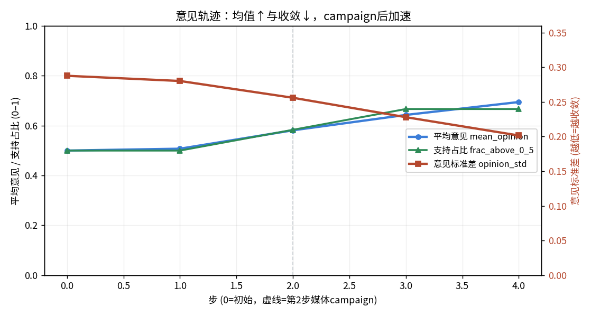
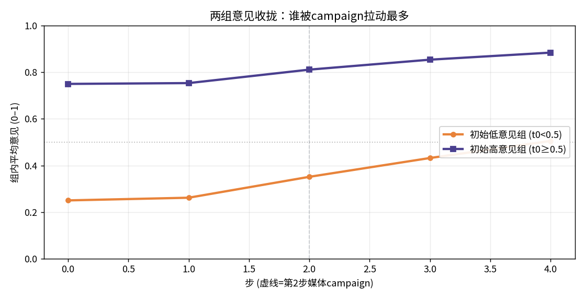

# Opinion diffusion under a media campaign (from-scratch template)

> 版本/模式：**真实 LLM (gpt-4o-mini, llm_kind=openai)**

## 结论速览

- 追踪 **12 个**固定 agent（环形网络，面板数据），共 **4 步**（step 0 为初始，第 2 步投放媒体campaign）。
- **平均意见 0.500→0.695（+0.195）**：campaign前 1 步仅 +0.007，campaign当步跳 +0.074，之后持续抬升。
- **意见标准差 0.288→0.202（-0.086）**：单调下降 = 群体持续收敛（共识化）。
- **支持占比(≥0.5) 50%→67%**：多数派向“支持”一侧移动。
- 决策层：真实 LLM (gpt-4o-mini, llm_kind=openai)（每 agent 每步一次 LLM 角色扮演，未解析回复回退到有界信心规则）。

## 意见轨迹（均值 / 收敛 / 支持占比）

| 步 | 平均意见 | 意见标准差 | 支持占比(≥0.5) | 事件 |
|---|---|---|---|---|
| 0（初始） | 0.500 | 0.288 | 50% |  |
| 1 | 0.507 | 0.280 | 50% |  |
| 2 | 0.581 | 0.256 | 58% | media pressure ramps up at the campaign step |
| 3 | 0.643 | 0.228 | 67% |  |
| 4 | 0.695 | 0.202 | 67% |  |

## 两组意见收拢（按初始意见分组）

| 组 | 初始均值 | 期末均值 | 变动 |
|---|---|---|---|
| 初始低意见组 (t0<0.5) | 0.250 | 0.505 | +0.255 |
| 初始高意见组 (t0≥0.5) | 0.750 | 0.884 | +0.134 |

## 发现与解读 (Findings)

1. **campaign 是意见抬升的拐点，而非匀速漂移。** 平均意见在 campaign 前 1 步几乎不动（+0.007），第 2 步媒体压力(macro-physical)与 campaign 广播(macro-information)同时生效后单步跳升 +0.074，其后仍逐步爬升到 0.695。机制：`decide_batch` 里 media/campaign 两项外推力把每个 agent 往 1 拉，且拉力随剩余空间 (1−opinion) 递减，故先快后缓。
2. **收敛(方差下降)贯穿全程，且不依赖 campaign。** opinion_std 从 0.288 单调降到 0.202（-0.086），第1步(campaign前)已在下降。机制：有界信心邻域平均——每个 agent 向意见差≤0.3 的邻居靠拢——本身就是收缩算子，campaign 叠加的是“共同上移”，收敛来自 peer averaging。
3. **低意见组被拉动得更多。** 初始低意见组均值上移 +0.255，高意见组 +0.134（低组更大）。机制：外推力项 (1−opinion) 对起点低者留有更大上升空间，故 campaign 对“尚未支持”人群的边际拉动更强，两组向中上区间收拢。

## 深层洞察 (Deeper insights)

- **两种动力学可分离**：收敛(std↓)由 *local* 邻居平均驱动、抬升(mean↑)由 *macro* 媒体/宣传驱动——报告里它们同向叠加，但第1步(std已降、mean几乎未动)证明二者机制独立。这正是 P/E 四象限设计（local_physical vs macro_physical/information）要展示的：局部同化与宏观推动可以解耦观察。
- **支持占比是滞后、跳变的指标**：mean_opinion 连续爬升，但 frac_above_0_5 只在个别 agent 跨过 0.5 时阶跃（50%→67%），说明“多数翻转”比“平均态度移动”更晚发生——用平均值判断舆论转向会高估翻盘速度。
- **真实说服效应远小于本 demo**：grounding 记录的实证单次说服效应约 0.012（归一化），本 demo 的 media_gain/campaign_gain 被放大约 8–12 倍才能在 4 步内看出弯折；真实量级下同一 campaign 的曲线会平缓得多，读数时须把幅度当作风格化。

## 改进建议与下一步 (Recommendations & next steps)

- **对照组实验**：/sv-iterate 复制一版把 campaign 关闭（去掉 step-2 broadcast + media 事件），对比 mean_opinion 差值，直接量化 campaign 的净效应（当前无反事实基线）。
- **校准到真实效应量**：把 media_gain/campaign_gain 调到 grounding 的 ~0.012 量级并拉长 n_steps，检验“弱但持续”的宣传能否最终改变多数派——比 demo 的放大值更接近现实。
- **扫 confidence 阈值**：当前 0.3<共识临界值 0.5（见 grounding）。扫 0.1–0.5 观察何时出现意见分裂(多簇)而非单一共识，复现有界信心模型的经典相变。
- **scripted vs LLM 对照**：本次为 LLM 决策层，可 /sv-iterate 出一版 scripted(确定性规则)做 parity 对照，看 LLM 角色扮演相比纯规则是否引入系统性偏移（如更强/更弱的从众）。

## 数据基础与参考来源

| 事实 | 值 | 依据 | 来源 |
|---|---|---|---|
| 有界信心模型的信心阈值 ε 常用取值区间(归一化 [0,1] 意见尺度) | 0.2–0.5 ε (归一化意见距离) | 实证 | Lorenz 2007 综述 / HK 2002:ε 常在 0.2–0.5 之间取值 (https://arxiv.org/pdf/0707.1762) |
| HK 模型达成全局单一共识的信心阈值临界值(归一化 [0,1]) | 0.5 ε 临界值 | 实证 | A straightforward proof of the critical value in the Hegselmann-Krause model: up to one-half (https://doi.org/10.48550/arxiv.2408.03718) |
| Deffuant 类模型的收敛率 μ(每次互动向对方/邻域均值移动的比例)常用值 | 0.5 μ (移动比例) | 实证 | Lorenz 2007 综述:Deffuant-Weisbuch 收敛参数 μ 典型取 0.5 (https://arxiv.org/pdf/0707.1762) |
| 大众媒体/政治广告的单次说服效应量(实证,极小) | 0.012 归一化 [0,1] 意见变动 (源: 0.049/5 分制) | 代理 | Coppock et al. (2020, PNAS) 59 个实时随机实验:广告平均使好感度移动 0.049(5 分制)≈0.012(归一化) (https://pmc.ncbi.nlm.nih.gov/articles/PMC7467695/) |

**建模参考**

- Lorenz (2007) Continuous Opinion Dynamics under Bounded Confidence: A Survey — 权威综述,覆盖 Deffuant-Weisbuch 与 Hegselmann-Krause 两类有界信心模型:agent 只与意见差<ε的邻居平均,收敛率 μ 常取 0.5——直接支撑本 study 的 peer averaging + confidence 阈值机制。
- Hegselmann & Krause (2002) Opinion Dynamics and Bounded Confidence: Models, Analysis and Simulation (JASSS 5(3)) — HK 模型原始论文:每步 agent 把意见更新为其信心邻域内所有意见的均值;ε 越大越易达成共识——本 study 的 decide_batch 即 HK 式邻域平均的简化。

**声明的假设**

- media_gain=0.1、campaign_gain=0.15 相对实证单次说服效应(~0.012,见 f-media-persuasion)被显式放大约 8–12 倍。 — 教学/演示 study 只跑 3–4 小步,须让 macro-physical(媒体压力)与 macro-information(campaign 广播)的外推力在如此短的时程内产生肉眼可辨的均值抬升与收敛;真实量级会让 4 步内曲线几乎不动。这是刻意的风格化选择,非真实效应量。
- 12 个 agent 排成环、每人只与左右 2 个邻居交流,为最小可解释网络拓扑。 — 演示 local_physical 观测象限与 contagion 传播模式所需的最简显式网络;非真实社交网络数据。真实规模/度分布可作为可调参数扩展。
- 初始意见沿 [0,1] 均匀铺开((i+0.5)/n),使人群起点最大离散。 — 确定性初始化,便于复现并让 opinion_std 的下降(收敛)清晰可见;非抽样自真实民调分布。